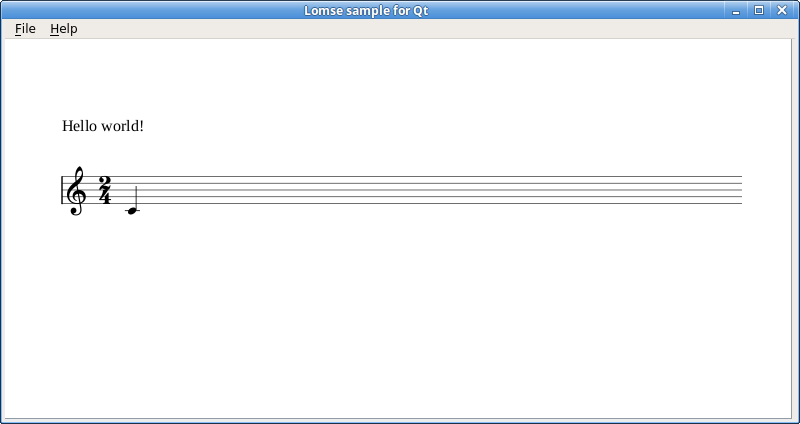

# Tutorial 1 for Qt. Displaying a music score.

This folder contains the source code and the documentation for tutorial #1.

This tutorial is meant to be an introduction to using Lomse in a Qt program, and shows how to open a window and to display a music score on it.


# Table of contents
- [How does Lomse work](#lomse)
- [Specifications: displaying a score](#specifications)
- [Header files to use Lomse](#headers)
- [Declarations](#declarations)
- [main() function implementation](#myapp)
- [MainWindow constructor](#myframe)
- [Initializing the Lomse library](#init-lomse)
- [Creating the score and the View](#open-document)
- [Creating the bitmap for the rendering buffer](#bitmap)
- [Painting the window](#paint)
- [Closing the application](#close)
- [Compiling your code and building](#compile)
- [Conclusions](#conclusions)


## <a name="lomse" />How does Lomse work

In this first example we are just going to open a window and display an score on it.

The first and most important thing to learn about Lomse is that is platform independent code, with no knowledge about your platform native windows. And, of course, Lomse knows nothing about Qt and its classes `QMainWindow`, `QApplication`, etc. Therefore, **Lomse can not directly render scores on any Qt object**.

Lomse works by rendering the scores on a bitmap buffer, that is, on an array of consecutive memory bytes. As this buffer is provided by the user application, it can be any type of memory, such as a real bitmap, a window's buffer, etc. This implies that before using Lomse you should decide what is the best approach for using Lomse in your application.

The simplest and usual way of rendering scores on a window is just passing Lomse a bitmap in memory, asking Lomse to render on that bitmap, and copying the bitmap onto the window. And this is the approach we will follow for our Qt application.

But Lomse knows nothing about QBitmap, QImage, QLabel or other suitable Qt objects. For Lomse, a bitmap is just an array of bytes containing the image pixels. But a QImage object can be created from an array of bytes containing the image pixels:

```c++
QImage(uchar* data, int width, int height, Format format, 
       QImageCleanupFunction cleanupFunction = 0, 
       void* cleanupInfo = 0)
```

And this image can be rendered doing something as:

```c++
QPainter painter(this);
QImage image(...);
painter.drawImage(0, 0, image);
```

Therefore, for using Lomse in this Qt tutorial I will render the bitmap provided by Lomse by using a QImage object.

The next step is deciding what pixel format should Lomse use. Lomse supports a lot of pixel formats but are
platform dependent because byte order is different in
big endian and little endian architectures. Doing some research on the formats supported by QImage, a suitable one
is `QImage::Format_RGBA8888`. According to Qt documentation this format uses 32 bits per pixel (one byte per pixel) and, 
as Lomse bitmap formats, the byte ordering differs between
big endian and little endian architectures, being respectively (0xRRGGBBAA) 
and (0xAABBGGRR). So this format matches Lomse format `k_pix_format_rgba32`.

Therefore, I will use pixel format the pixel format `k_pix_format_rgba32` for
Lomse and `QImage::Format_RGBA8888` for Qt. Both are internally the same format:
an array of pixels in the top-to-bottom, left-to-right order, and each pixel is
encoded in four bytes.

So, once we've learn that Lomse renders on bitmaps and once we have found a solution for communicating Qt with Lomse, let's start with our application.


## <a name="specifications" />Specifications: displaying a score

In this first example we are just going to open a window and display an score on it. For displaying a score the work to do is minimal:
- Initialize the Lomse library,
- Pass Lomse the source code for the score to render and a buffer for the bitmap. Lomse will render the score on this memory.
- Finally, open a window and display the bitmap on it

In this example, the source code for the score is embedded in the source code. In a real program you normally will read a file containing the score to display or you will create, by program, the source code for the score. We will do that in a more advanced tutorial.

With previous specifications, the structure of our program will be very simple. When the app starts running it will create the main window (class MainWindow, derived from QMainWindow) which, in turn, will create a window for displaying the score (class MyCanvas). For it, we will pass Lomse a bitmap, and will ask Lomse to create the score. Then we will render the bitmap on the window. And that's all.
Let's start programming.


## <a name="headers" />Header files to use Lomse

Before we get into the heart of our basic example, we will include the needed headers. After the usual stuff and headers for Qt, I've included the Lomse needed headers. At the time of writing this the Lomse API is not yet fixed; therefore there is not a single header file (or set of headers) to include. Instead, the headers to include will depend on the classes and functions you would like to use. Anyway, with current API you will always include:

```c++
#include <lomse_doorway.h>
#include <lomse_document.h>
#include <lomse_graphic_view.h>
#include <lomse_interactor.h>
#include <lomse_presenter.h>
#include <lomse_events.h>

using namespace Lomse;
```

`LomseDoorway` is the main interface with the Lomse library. `Document` represents the score to display and is part of the Lomse Model-View-Controller (MVC) architecture. `GraphicView` is a kind of `View` (the window in which the score is going to be displayed). `Interactor` is the controller for the `View`. `Presenter` is also part of the MVC model, and is responsible for maintaining the relationships between a `Document` and its different views and associated interactors. Finally, `lomse_events.h` is required to deal with events received from the Lomse library.

These header files can be typically found in `/usr/local/include/lomse`.


## <a name="declarations" />Declarations

After headers we are going to declare our application classes: `MainWindow` and `MyCanvas`.

`MainWindow` is very simple. It has only a few methods. I will explain them when we arrive to the implementation part, so forget about them for now and let's focus on declaring the variables:

```c++
LomseDoorway m_lomse;        //the Lomse library doorway
MyCanvas* m_canvas;
```

`m_lomse` is an important variable as it is the main interface with the Lomse library. As we will see later, we have to use it for specifying certain Lomse initialization options. The other variable, `m_canvas` is just the window that we will use to render the score.

With this we have finished declaring `MainWindow`. Here is the code:
```c++
class MainWindow : public QMainWindow
{
    Q_OBJECT

public:
    MainWindow();

private slots:
    void on_about();

public:
    ~MainWindow();

    //commands
    void open_test_document();

protected:
    void create_actions();
    void create_menu();

    //lomse related
    void initialize_lomse();

protected:

    //Qt stuff, for the GUI

    MyCanvas* m_canvas;
    QScrollArea* scrollArea;

    QAction* m_aboutAction;
    QAction* m_exitAction;

    QMenu* m_fileMenu;
    QMenu* m_helpMenu;

    //Lomse stuff

    LomseDoorway    m_lomse;        //the Lomse library doorway
};
```


Next, we have the declaration of `MyCanvas` class. It is a window on which we show the scores. It derives from QWidget. All the functionality for rendering scores and interacting with them will be in this class. Therefore, we need to declare some event handlers and needed methods. Again, let's postpone the description of them until we arrive to the implementation part. And let's focus on declaring some important variables needed by Lomse:

```c++
LomseDoorway&   m_lomse;        //the Lomse library doorway
Presenter*      m_pPresenter;   //relates the View, the Document and the Interactor
```

`m_lomse` is the main interface with the Lomse library. It was created by `MainWindow`, and `MyCanvas` receives it as parameter in the constructor. The other variable, `m_pPresenter` is a pointers to one important component of the Lomse Model-View-Controller (MVC) architecture. The `Presenter` is responsible for maintaining the relationships between a Document and its different Views and associated interactors. Later, we will learn more about them.

Next we are going to declare here the pointer to the memory area to be used by Lomse to render the score and create the bitmap:

```c++
unsigned char*      m_pdata;                    //ptr to the bitmap
int                 m_nBufWidth, m_nBufHeight;	//size of the bitmap
```

As learn, Lomse knows nothing about Qt, so the Lomse View renders the music scores on a raw bitmap in memory. To manage this bitmap, we had defined a variable, `m_pdata`, that will point to the memory that we will allocate for the raw bitmap, and we will use variables `m_nBufWidth` and `m_nBufHeight` to store the size of the needed bitmap.

With this we have finished declaring `MyCanvas`. Here is the code:
```c++
class MyCanvas : public QWidget
{
public:
    MyCanvas(QWidget* parent, LomseDoorway& lomse);
    ~MyCanvas();

    void update_view_content();

    //commands
    void open_test_document();

protected:
    //event handlers
    void paintEvent(QPaintEvent *event);
    void resizeEvent(QResizeEvent* event);

    void delete_rendering_buffer();
    void create_rendering_buffer(int width, int height);
    void update_rendering_buffer_if_needed();


        //Lomse stuff

    // In this first example we are just going to display an score on a window.
    // Let's define the necessary variables:
    LomseDoorway&   m_lomse;        //the Lomse library doorway
    Presenter*      m_pPresenter;

    //the Lomse View renders its content on a bitmap. We define here the
    //memory area to be used to create the bitmap
    unsigned char*      m_pdata;                    //ptr to the bitmap
    int                 m_nBufWidth, m_nBufHeight;	//size of the bitmap

    //some additional variables
    bool    m_view_needs_redraw;      //to control when the View must be re-drawn
};
```

With this, we have finished the declarations. Lets's go now to the implementation.


## <a name="myapp">main() function implementation

The main() function is standard stuff in Qt. We only have to create the `MainWindow` instance and display it. Here is the code:

```c++
int main(int argc, char* args[])
{
    QApplication app(argc, args);
    app.setOrganizationName("LenMus");
    app.setApplicationName("Lomse. Tutorial 1");

    MainWindow window;
    window.show();

    return app.exec();
}
```


## <a name="myframe" />MainWindow constructor

`MainWindow` is a simple class having the only responsibility of managing the GUI main controls: the menu and the window for displaying the scores. Therefore, in constructor we will do only a few things:

```c++
MainWindow::MainWindow()
    : QMainWindow()
    , m_canvas(NULL)
{
    // create our one and only child: the canvas to display the score
    m_canvas = new MyCanvas(this, m_lomse);
    setCentralWidget(m_canvas);
    m_canvas->setMinimumSize(100, 100);

    setWindowTitle(tr("Lomse sample 1 for Qt"));
    create_actions();
    create_menu();
    initialize_lomse();

    resize(790, 400);

    // load the score to display
    open_test_document();
}
```

As you can see it is just a few tasks: create the canvas window, create the main menu, initialize the Lomse library and open the score to display. Methods `create_actions` and `create_menu()` are the typical Qt stuff. In this first example, the menu is not necessary but I have included it to set up the foundations for adding more functionality in following tutorials. In this first tutorial we are going to include only two menu items "File > Exit" and "Help > About". Here is the code:

```c++
void MainWindow::create_actions()
{
    m_aboutAction = new QAction(tr("&About"), this);
    connect(m_aboutAction, SIGNAL(triggered()), this, SLOT(on_about()));

    m_exitAction = new QAction(tr("E&xit"), this);
    connect(m_exitAction, SIGNAL(triggered()), qApp, SLOT(quit()));
}

void MainWindow::create_menu()
{
    m_fileMenu = menuBar()->addMenu(tr("&File"));
    m_fileMenu->addAction(m_exitAction);

    m_helpMenu = menuBar()->addMenu(tr("&Help"));
    m_helpMenu->addAction(m_aboutAction);
}
```


## <a name="init-lomse">Initializing the Lomse library

The interesting part in `MainWindow` constructor is the initialization of the Lomse library. As Lomse renders music scores on a bitmap it is necessary to inform Lomse about the bitmap format to use, and about other related parameters that are platform dependent. As explained, for this Qt application I will use bitmaps in RGBA, 32 bits format (Lomse format k_pix_format_rgba32). Apart of specifying the bitmap format to use, Lomse needs to know the screen resolution to use. This value is not important because Lomse uses vectorial graphics for all, typography included and, thus, your application can always scale the image to as much resolution as you like. Nevertheless, Lomse requires a screen resolution value to adjust internal scaling factors so that when your application sets the scale to 1.0 (100%) the document get displayed on the screen at real size. If this is not a requirement for your application, any typical value can be used (e.g. 72, 96, 144, ...). Therefore, we can use a value of 96ppi, typical for Linux and Windows systems. In a real application, probably you should get this value by invoking some operating system related methods.

One we have decided on the values to use, let's write the code:

```c++
void MainWindow::initialize_lomse()
{
    //the pixel format
    int pixel_format = k_pix_format_rgba32;

    //the desired resolution: 96 pixels per inch
    int resolution = 96;    //96 ppi

    //Now, initialize the library with these values
    m_lomse.init_library(pixel_format, resolution);
}
```


## <a name="open-document" />Creating the score and the View

The final step in `MainWindow` constructor is to invoke method `open_test_document()`.
This is a facade method that just delegates on the canvas:

```c++
void MainWindow::open_test_document()
{
    m_canvas->open_test_document();
}
```


`open_test_document()` method is the equivalent for the typical `open_document` method in which your application opens a dialog for requesting the file to open, and then, processes and displays it. In our example, the score is in a string, so the only thing to do is to request Lomse to create a new document with the specified content. When creating a document, Lomse automatically, creates a View to display it and an Interactor (a kind of Controller for the View). The `open_documented()` method is as follows:

```c++
void MyCanvas::open_test_document()
{
    //Normally you will load the content of a file. But in this
    //simple example we will create an empty document and define its content
    //from a text string

    //First, we will create a 'Presenter' object. It takes care of creating 
    //and maintaining all objects and relationships between the document, 
    //its views and the interactors to interact with the view
    delete m_pPresenter;
    m_pPresenter = m_lomse.new_document(ViewFactory::k_view_vertical_book,
        "(lenmusdoc (vers 0.0)"
            "(content "
                "(para (txt \"Hello world!\"))"
                "(score (vers 2.0) "
                    "(instrument (musicData (clef G)(key C)(time 2 4)(n c4 q) )))"
            ")"
        ")",
        Document::k_format_ldp
    );

    //get the pointer to the interactor and register for receiving desired events
    if (SpInteractor spInteractor = m_pPresenter->get_interactor(0).lock())
    {
        //In this example we are not going to set event handlers but this is
        //the right place to do it, once the document is created.
        //spInteractor->add_event_handler(......);
    }
}
```

The `Presenter` is the key object that relates a Document with its Views and Interactors. Also is the access point to get pointers to the Document and its Interactors. Deleting the Presenter also deletes all other related objects.
For creating the Presenter (and associated objects) we invoke LomseDoorway method `new_document()`, passing as arguments, the type of View to create and the content for the document (note: there are other methods, oriented to create the View from a file or programatically, but we will not study them in this simple example).

The View type is just a Lomse enum. In this example, value `ViewFactory::k_view_vertical_book` means that we would like to display the score as book pages, one page after the other in a vertical layout. Other View formats are possible out-of-the-box, such as horizontal book or not paginated (the score in a single system) but, in any case, its not complex to develop your own View format.

The next parameter is a C string containing the score, and the last parameter is a constant `Document::k_format_ldp` that specifies the language in which this score is written. In this example it is written in LenMus LDP language, but Lomse also supports other formats, such as MusicXML.

Let's analyse the string with the score. Fort this, I will split it into lines:
```
(lenmusdoc (vers 0.0)
    (content
        (para (txt "Hello world!"))
        (score (vers 2.0)
            (instrument
                (musicData
                    (clef G)
                    (key C)
                    (time 2 4)
                    (n c4 q)
                )
            )
        )
    )
)
```

First line means that it is a LenMus document, with version 0.0 format. Next line describes the content of the document. The content is just two elements: a paragraph ('para' element) containing text "Hello world!" and a 'score' element. Other types of content are possible: headers, images, tables, lists, etc. You can see LenMus documents as HTML documents, but allowing also a new type of content: scores.

The score element contains one instrument (this implies, by default, one staff). Finally, element 'musicData' describes the content for this instrument. In the example, a G clef, a C key signature, a 2/4 time signature and a quarter C4 note.

For a detailed description of the LDP language see the [LDP Reference Manual](https://lenmus.github.io/ldp/).

Once the Document and a View for it are created, we just get pointers to the Interactor, so that we can 'communicate' with the Document and its View:
```c++
    //get the pointer to the interactor
    if (SpInteractor spInteractor = m_pPresenter->get_interactor(0).lock())
    {
```

Lomse architecture is based on the Model-View-Controller pattern, and supports multiple simultaneous Views for a Document. By default, when creating a Document also a View and its associated `Interactor` are created. So, parameter `'0'` in `get_interactor(0)` refers to first `Interactor`, in this case, the only one created.


## <a name="bitmap" />Creating the bitmap for the rendering buffer

In last line of `open_test_document()` we passed to the interactor the address of the rendering buffer but, we have not yet allocated any memory for the bitmap! Don't worry, the bitmap will not be used until we ask Lomse to render something, so we can delay its creation until really needed. But let's study now the code for creating the rendering buffer. As we will render the bitmap on the QWidget area, the required bitmap size will change if the window is resized. Therefore, the method for creating the rendering buffer needs to receive as parameters the desired bitmap size. Here is the code:

```c++
void MyCanvas::create_rendering_buffer(int width, int height)


{
    //allocate memory for the Lomse rendering buffer.

    #define BYTES_PER_PIXEL 4   //the chosen format is RGBA, 32 bits

    //delete current buffer
    delete_rendering_buffer();

    // allocate a new rendering buffer
    m_nBufWidth = width;
    m_nBufHeight = height;
    m_pdata = (unsigned char*)malloc(m_nBufWidth * m_nBufHeight * BYTES_PER_PIXEL);

    //use this memory as Lomse rendering buffer
    if (SpInteractor spInteractor = m_pPresenter->get_interactor(0).lock())
    {
        spInteractor->set_rendering_buffer(m_pdata, m_nBufWidth, m_nBufHeight);
    }

    m_view_needs_redraw = true;
}
```

In this method we start by deleting the previous buffer and allocating memory for the new bitmap:

```c++
    //delete current buffer
    delete_rendering_buffer();

    // allocate a new rendering buffer
    m_nBufWidth = width;
    m_nBufHeight = height;
    m_pdata = (unsigned char*)malloc(m_nBufWidth * m_nBufHeight * BYTES_PER_PIXEL);
```

And then we tell Lomse to use this memory as rendering buffer:

```c++
    //use this memory as Lomse rendering buffer
    if (SpInteractor spInteractor = m_pPresenter->get_interactor(0).lock())
    {
        spInteractor->set_rendering_buffer(m_pdata, m_nBufWidth, m_nBufHeight);
    }
```

The need to create a new rendering buffer comes from two events: either because the window is being created or because the window size has changed. And in any case, before displaying this new bitmap we need to ask Lomse to paint something on it! So, as a final step we raise a flag to signal that the window has to be repainted:

```c++
    m_view_needs_redraw = true;
```

With this, we have finished this method.


## <a name="paint" />Painting the window

In function `open_test_document()` we have created a Lomse Document and its associated View. But Lomse has not yet rendered the score on the bitmap and nothing has been yet displayed in `MyCanvas`.  We will study now how the score is displayed in the window.

After invocation of `open_test_document()`, instances of `MainWindow` and `MyCanvas` are already created and there are no more work to do. So the application enters in the main loop for handling events. In the queue there are several events waiting for execution. One of them is a `QResizeEvent` that takes place before painting the QWidget window. Therefore, this event is dispatched and finally arrives to `MyCanvas::resizeEvent()` handler method. Here is the code for dealing with it:

```c++
void MyCanvas::resizeEvent(QResizeEvent* event)
{
    QSize size = event->size();
    create_rendering_buffer(size.width(), size.height());
}
```

The only thing to do whenever the window is resized is to create a new bitmap. After a QResizeEvent Qt will generate a QPaintEvent. And when the `QPaintEvent` arrives we only have to repaint the window. Here is the code for dealing with paint events:


```c++
void MyCanvas::paintEvent(QPaintEvent* event)
{
    if (m_pPresenter)
    {
        update_rendering_buffer_if_needed();
        if (!m_pdata)
            return;

        QPainter painter(this);
        QImage image(m_pdata, m_nBufWidth, m_nBufHeight, QImage::Format_RGBA8888);
        QRect dirtyRect = event->rect();
        painter.drawImage(dirtyRect, image, dirtyRect);
    }
}
```

If there is no Presenter is because the window has just been created and nothing else has been done. In this case, just ignore the event, as there is nothing to paint. This can never happen in our sample code but it can be a safeguard to avoid spurious crashes in more complex applications.

If the Presenter is already created, the only thing to do is to ask Lomse to paint the bitmap and then copy it to the window. But notice that we don't have to ask Lomse to paint the bitmap whenever a `QPaintEvent` event arrives. These events are generated because several reasons. The most frequent is when our window image is damaged (i.e. another window covering our window has moved). But in these cases the image is preserved in the bitmap so it is enough to re-display the bitmap. Other cases for receiving paint events are because the window has changed: when the window is created or when it is resized or when our program changes its content (i.e. because the if the user asks to open a different score). In our application this last case is not possible and so, the only source for additional paint event come from resize events.

But as we have seen, whenever the window is resized a new bitmap is automatically created, and flag `m_view_needs_redraw` is set. Therefore, this flag can be used to determine if have to ask Lomse to repaint the bitmap. Here is the code:


```c++
void MyCanvas::update_rendering_buffer_if_needed()
{
    if (m_view_needs_redraw)
        update_view_content();

    m_view_needs_redraw = false;
}

void MyCanvas::update_view_content()
{
    if (!m_pPresenter) return;

    if (SpInteractor spInteractor = m_pPresenter->get_interactor(0).lock())
        spInteractor->redraw_bitmap();
}
```

Finally, the execution of method `MyCanvas::paintEvent` continues to refresh the display:

```c++
QPainter painter(this);
QImage image(m_pdata, m_nBufWidth, m_nBufHeight, QImage::Format_RGBA8888);
QRect dirtyRect = event->rect();
painter.drawImage(dirtyRect, image, dirtyRect);
```

That's all !


## <a name="close" />Closing the application

Finally, the last important point to comment is to remind you that, to avoid memory leaks, when closing the application it is necessary to delete the rendering buffer and the Presenter (which in turn will delete all Lomse related objects, such as the View, the Document and the Interactor). This code has been included in `MyCanvas` destructor:

```c++
MyCanvas::~MyCanvas()
{
    delete_rendering_buffer();

    //delete the Presenter. This will also delete the Document, the Interactor,
    //the View and other related objects
    delete m_pPresenter;
}
```

With this, I finish the explanation of the code. In the next section we are going to build and run our code.


## <a name="compile" />Compiling your code and building

Before starting, ensure that you have installed the Lomse library. See the [installation](https://github.com/lenmus/lomse/wiki/Installation) page for detailed instructions.

A .pro file is always nedeed for building a Qt program. Therefore it must be created from sources (using qmake) or you should use the provided file. 

The simplest way to build the sample is by using the provided .pro file:

1. Move to the directory containing the project:

```bash
cd <projects>/lomse/examples/tutorials/tutorial-1-qt
```

2. create a platform specific MakeFile:

```bash
qmake tutorial-1-qt.pro
```

3. Build the program by running make:

```bash
make
```

4. After running `make`, you will find a executable file, named tutorial-1-qt, in current directory. For executing your first Qt program using Lomse just do:
```bash
./tutorial-1-qt
```

You should see something as:




## Creating .pro file if it does not exist

1. Open a terminal window, move to the directory containing the sample code:

```
cd <projects>/lomse/examples/tutorials/tutorial-1-qt
```

2. Create a Qt project by running qmake command with option -project. The project will contain all the .cpp and .h files in current directory. Therefore, ensure that current folder only contains the sources for this example. Then execute:

```
qmake -project -o tutorial-1-qt.pro
```

This will create a project file called tutorial-1-qt.pro and include our files tutorial-1-qt.cpp and tutorial-1-qt.h into it.

3. The project file (.pro) has to be modified for including the Qt and Lomse headers and linking to the Qt and Lomse libraries. For this, the best way is to use the pkg-config tool. Open the .pro file created in previous step and add the following lines:

```
QT += core gui
greaterThan(QT_MAJOR_VERSION, 4): QT += widgets

CONFIG += link_pkgconfig
CONFIG += c++11
PKGCONFIG += liblomse
```


## <a name="conclusions" />Conclusions

This document is a very basic introduction. In the second tutorial I will add more code to our sample application for opening files with scores and interacting with the scores (zooming, dragging, selecting objects, etc.).

If you would like to contribute with more tutorials or by adapting this tutorial for other platforms, you are welcome!. Please open an issue or send a Pull Request. Thank you!


