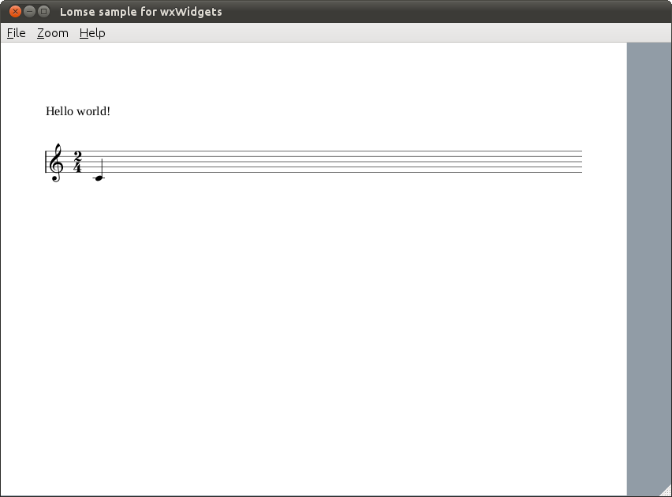

# Lomse library. Tutorial 1 for wxWidgets

This is meant to be an introduction to using Lomse in a wxWidgets program.

## Table of contents

- [How does Lomse work](#lomse)
- [Specifications: displaying a score](#specifications)
- [Header files to use Lomse](#headers)
- [Declarations](#declarations)
- [MyApp implementation](#myapp)
- [MyFrame constructor](#myframe)
- [Initializing the Lomse library](#init-lomse)
- [Creating the score and the View](#open-document)
- [Creating the bitmap for the rendering buffer](#bitmap)
- [Painting the window](#paint)
- [Closing the application](#close)
- [Compiling your code and building](#compile)
- [Conclusions](#conclusions)

## <a name="lomse" />How does Lomse work

In this first example we are just going to open a window and display an score on it.

The first and most important thing to learn about Lomse is that is platform independent code, with no knowledge about your platform native windows. And, of course, Lomse knows nothing about wxWidgets, <tt>wxFrame</tt>, <tt>wxDC</tt> and <tt>wxWindow</tt>. Therefore, **Lomse can not directly render scores on any wxWindow object.**

Lomse works by rendering the scores on a bitmap buffer, that is, on an array of consecutive memory bytes. As this buffer is provided by the user application, it can be any type of memory, such as a real bitmap, a window's buffer, etc. This implies that before using Lomse you should decide what is the best approach for using Lomse in your application.

The simplest and usual way of rendering scores on a window is just passing Lomse a bitmap in memory, asking Lomse to render on that bitmap, and copying the bitmap onto the window. And this is the approach we will follow for our wxWidgets application.

To render a bitmap in wxWidgets we usually would use a wxBitmap and do something as:

```c++
wxMemoryDC memoryDC;
wxBitmap* pBitmap;
memoryDC.SelectObject(*pBitmap);
dc.Blit(0, 0, width, height, &memoryDC, 0, 0);
```

But Lomse knows nothing about wxBitmap objects. For Lomse, a bitmap is just an array of bytes containing the image pixels, whereas wxBitmap is a platform dependent class containing a buffer for pixels (in a platform dependent format) and additional data.

We could think on using a native Lomse bitmap and building later a wxBitmap object from it. This solution is complex, puts the work on the user application and also requires platform dependent code. Moreover, it requires internal knowledge about wxBitmap format.

So the best approach I've found for using Lomse in wxWidgets applications is to use an wxImage object. First, wxImage is a platform independent class. Therefore, with this choice, we keep our application free of a lot of conditional compilation statements for supporting different platforms. Second, wxImage contains an internal buffer for the image. It is documented and publicly accessible. It is an array of characters in RGBRGBRGB... format, arranged in top-to-bottom, left-to-right order. That is, the first RGB triplet corresponds to the first pixel of the first row; the second RGB triplet corresponds to the second pixel of the first row, and so on until the end of the first row, with second row following after it and so on. In summary, wxImage contains a buffer for a bitmap in RGB, 24 bits format. Luckily, this is one of the bitmap formats supported by Lomse. And, as a bonus, wxImage can be easily converted to an wxBitmap and, therefore, it can be rendered by your application.

So, once we've learn that Lomse renders on bitmaps and once we have found a solution for communicating wxWidgets with Lomse, let's start with our application.

## <a name="specifications" />Specifications: displaying a score

In this first example we are just going to open a window and display an score on it. For displaying a score the work to do is minimal:

1.  Initialize the Lomse library,
2.  Pass Lomse the source code for the score to render and a bitmap. Lomse will render the score on the bitmap.
3.  Finally, open a window and display the bitmap on it

In this example, the source code for the score is embedded in the code. In a real program you normally will read a file containing the score to display or you will create, by program, the source code for the score. We will do that in a more advanced tutorial.

With previous specifications, the structure of our program will be very simple. The application will be modeled by class MyApp, derived from wxApp. When the app starts running it will create the main frame (class MyFrame, derived from wxFrame) which, in turn, will create a window for displaying the score (class MyCanvas). For it, we will pass Lomse a bitmap, and will ask Lomse to create the score. Then we will render the bitmap on the window. And that's all.

Let's start programming.

## <a name="headers" />Header files to use Lomse

Before we get into the heart of our basic example, we will include the needed headers. After the usual stuff and headers for wxWidgets, I've included the Lomse needed headers. At the time of writing this the Lomse API is not yet fixed; therefore there is not a single header file (or set of headers) to include. Instead, the headers to include will depend on the classes and functions you would like to use. Anyway, with current API you will always include:

```c++#include
<lomse_doorway.h>
#include <lomse_document.h>
#include <lomse_graphic_view.h>
#include <lomse_interactor.h>
#include <lomse_presenter.h>
#include <lomse_events.h>

using namespace Lomse;
```

`LomseDoorway` is the main interface with the Lomse library. `Document` represents the score to display and is part of the Lomse Model-View-Controller (MVC) architecture. `GraphicView` is a kind of `View` (the window in which the score is going to be displayed). `Interactor` is the controller for the `View`. `Presenter` is also part of the MVC model, and is responsible for maintaining the relationships between a `Document` and its different views and associated interactors. Finally, `lomse_events.h` is required to deal with events received from the Lomse library.

These header files can be typically found in `/usr/local/include/lomse`.


## <a name="declarations" />Declarations

After headers we are going to declare our application classes: `MyApp`, `MyFrame` and `MyCanvas`. The only thing `MyApp` is going to do is to create the main frame when the application is created. Therefore, we only need to override `OnInit` method. Here is `MyApp` declaration:

```c++
// Define the application
class MyApp: public wxApp
{
public:
    bool OnInit();

};
```

`MyFrame` is also very simple. It has only a few methods. I will explain them when we arrive to the implementation part, so forget about them for now and let's focus on declaring the variables:

```c++
LomseDoorway m_lomse;        //the Lomse library doorway
MyCanvas* m_canvas;
```

`m_lomse` is an important variable as it is the main interface with the Lomse library. As we will see later, we have to use it for specifying certain Lomse initialization options. The other variable, `m_canvas` is just the window that we will use to render the scores.

With this we have finished declaring `MyFrame`. Here is the code:

```c++
class MyFrame: public wxFrame
{
public:
    MyFrame();
    virtual ~MyFrame();

    //commands
    void open_test_document();

    //event handlers (these functions should _not_ be virtual)
    void OnQuit(wxCommandEvent& event);
    void OnAbout(wxCommandEvent& event);

protected:
    //accessors
    MyCanvas* get_active_canvas() const { return m_canvas; }

    //lomse related
    void initialize_lomse();

    void create_menu();

    LomseDoorway m_lomse;        //the Lomse library doorway
    MyCanvas* m_canvas;

    DECLARE_EVENT_TABLE()
};
```

Next, we have the declaration of `MyCanvas` class. It is a window on which we show the scores. It derives from wxWindow. All the functionality for rendering scores and interacting with them will be in this class. Therefore, we need to declare some event handlers and needed methods. Again, let's postpone the description of them until we arrive to the implementation part. And let's focus on declaring some important variables needed by Lomse:

```c++
LomseDoorway&   m_lomse;        //the Lomse library doorway
Presenter*      m_pPresenter;   //relates the View, the Document and the Interactor
```

`m_lomse` is the main interface with the Lomse library. It was created by `MyFrame` and `MyCanvas` receives it, as parameter, in the constructor. The two other variables, `m_pPresenter` and `m_pInteractor` are pointers to two important components of the Lomse Model-View-Controller (MVC) architecture. The `Interactor` is a kind of controller for the view. And the `Presenter` is responsible for maintaining the relationships between a Document and its different Views and associated interactors. Later, we will learn more about them.

Next we are going to declare a rendering buffer and its associated bitmap:

```c++
RenderingBuffer     m_rbuf_window;
wxImage*            m_buffer;       //the image to serve as buffer
unsigned char*      m_pdata;        //ptr to the bitmap
int                 m_nBufWidth, m_nBufHeight;  //size of the bitmap
```

As learn, Lomse knows nothing about wxWidgets, so the Lomse View renders the music scores on a bitmap. To manage the bitmap, Lomse associates the it to a `RenderingBuffer` object. As Lomse only renders on bitmaps, it is your application responsibility to do whatever is needed with it: rendering it on a wxWindow, exporting it as a file, printing it, etc. In our simple application, we are going to render the bitmap on the `MyCanvas` window. And to simplify bitmap management, we are going to use an wxImage as bitmap. Therefore, we had defined a variable, `m_pdata`, that will point to the internal wxImage bitmap, and we will use variables `m_nBufWidth` and `m_nBufHeight` to store the size of the needed bitmap.

With this we have finished declaring `MyCanvas`. Here is the code:

```c++
class MyCanvas : public wxWindow
{
public:
    MyCanvas(wxFrame *frame, LomseDoorway& lomse);
    ~MyCanvas();

    void update_view_content();

    //commands
    void open_test_document();

protected:
    //event handlers
    void OnPaint(wxPaintEvent& WXUNUSED(event));
    void OnSize(wxSizeEvent& event);

    void delete_rendering_buffer();
    void create_rendering_buffer(int width, int height);
    void copy_buffer_on_dc(wxDC& dc);
    void update_rendering_buffer_if_needed();

    // In this first example we are just going to display an score on the window.
    // Let's define the necessary variables:
    LomseDoorway&   m_lomse;        //the Lomse library doorway
    Presenter*      m_pPresenter;

    //the Lomse View renders its content on a bitmap. To manage it, Lomse
    //associates the bitmap to a RenderingBuffer object.
    //It is your responsibility to render the bitmap on a window.
    //Here you define the rendering buffer and its associated bitmap to be
    //used by the previously defined View.
    RenderingBuffer     m_rbuf_window;
    wxImage*            m_buffer;       //the image to serve as buffer
    unsigned char*      m_pdata;        //ptr to the bitmap
    int                 m_nBufWidth, m_nBufHeight;  //size of the bitmap

    //some additional variables
    bool    m_view_needs_redraw;      //to control when the View must be re-drawn

    DECLARE_EVENT_TABLE()
};
```

With this, we have finished the declarations. Lets's go now to the implementation.


## <a name="myapp" />MyApp implementation

The only method to implement is the `OnInit` method. In it, we only have to create the `MyFrame` instance and display it. And the, request `MyFrame` to open the score. Here is the code:

```c++
bool MyApp::OnInit()
{
    MyFrame* frame = new MyFrame;
    frame->Show(true);
    SetTopWindow(frame);

    frame->open_test_document();

    return true;
}
```


## <a name="myframe" />MyFrame constructor

<tt>MyFrame</tt> is a simple class having the only responsibility of managing the GUI main controls: the menu and the window for displaying the scores. Therefore, in constructor we will do only a few things:

```c++
MyFrame::MyFrame()
    : wxFrame(NULL, wxID_ANY, _T("Lomse sample for wxWidgets"),
              wxDefaultPosition, wxSize(850, 600))
{
    create_menu();
    initialize_lomse();

    // create our one and only child -- it will take our entire client area
    m_canvas = new MyCanvas(this, m_lomse);
    wxSizer *sz = new wxBoxSizer(wxVERTICAL);
    sz->Add(m_canvas, 3, wxGROW);
    SetSizer(sz);
}
```

As you can see it is just three tasks, create the main menu, initialize the Lomse library and create the canvas window, inside a <tt>wxSizer</tt>, so that the canvas is automatically resized to take always the entire <tt>MyFrame</tt> client area.

Method `create_menu()` is the typical wxWidgets stuff. In this first example, the menu is not necessary but I have included it to set up the foundations for adding more functionality in following tutorials. In this first tutorial we are going to include only two menu items "File > Exit" and "About". here is the code:

```c++
void MyFrame::create_menu()
{
    wxMenu *fileMenu = new wxMenu;
    fileMenu->Append(k_menu_file_quit, _T("E&xit"));

    wxMenu *helpMenu = new wxMenu;
    helpMenu->Append(k_menu_help_about, _T("&About"));

    wxMenuBar* menuBar = new wxMenuBar;
    menuBar->Append(fileMenu, _T("&File"));
    menuBar->Append(helpMenu, _T("&Help"));

    SetMenuBar(menuBar);
}
```

## <a name="init-lomse" />Initializing the Lomse library

The interesting part in `MyFrame` constructor is the initialization of the Lomse library. As Lomse renders music scores on a bitmap it is necessary to inform Lomse about the bitmap format to use, and about other related parameters that are platform dependent. As explained, for wxWidgets applications I've found that using a wxImage as bitmap buffer is a good strategy, as <tt>wxImage</tt> is a platform independent class and contains a buffer for a bitmap in RGB, 24 bits format.

Apart of specifying the bitmap format to use, Lomse needs to know the resolution to use and the y-axis orientation. In our application, the scores are going to be shown on screen. Therefore, we can use a value of 96ppi, typical for Linux and Windows systems. In a real application, probably you should get this value by invoking some operating system related methods (i.e. `wxDC::GetPPI()` method).

As to the y-axis orientation, Lomse needs to know if your presentation device follows the standard convention used in screen displays in which the y coordinates increases downwards, that is, y-axis coordinate 0 is at top of screen and increases downwards to bottom of screen. This convention is just the opposite of the normal convention for geometry, in which 0 coordinate is at bottom of paper and increases upwards. Lomse follows the standard convention used in displays (y-axis 0 coordinate at top and increases downwards). Therefore, in our application, we have to inform Lomse that the y-axis follows the standard convention for screens and, therefore, we won't Lomse to reverse it.

One we have decided on the values to use, let's write the code:

```c++
//the pixel format
int pixel_format = k_pix_format_rgb24;  //RGB 24bits

//the desired resolution. For Linux and Windows 96 pixels per inch works ok.
int resolution = 96;    //96 ppi

//Normal y axis direction is 0 coordinate at top and increase downwards. You
//must specify if you would like just the opposite behavior. For Windows and
//Linux the default behavior is the right behavior.
bool reverse_y_axis = false;

//initialize the library with these values
m_lomse.init_library(pixel_format,resolution, reverse_y_axis);
```

With this, we have finished Lomse initialization. Here is the full code:

```c++
void MyFrame::initialize_lomse()
{
    // Lomse knows nothing about windows. It renders everything on bitmaps and the
    // user application uses them. For instance, to display it on a wxWindows.
    // Lomse supports a lot of bitmap formats and pixel formats. Therefore, before
    // using the Lomse library you MUST specify which bitmap format to use.
    //
    // For wxWidgets, I would suggest using a platform independent format. So
    // I will use a wxImage as the rendering  buffer. wxImage is platform independent
    // and its buffer is an array of characters in RGBRGBRGB... format,  in the
    // top-to-bottom, left-to-right order. That is, the first RGB triplet corresponds
    // to the first pixel of the first row; the second RGB triplet, to the second
    // pixel of the first row, and so on until the end of the first row,
    // with second row following after it and so on.
    // Therefore, the pixel format is RGB 24 bits.
    //
    // Let's define the required information:

        //the pixel format
        int pixel_format = k_pix_format_rgb24;  //RGB 24bits

        //the desired resolution. For Linux and Windows 96 pixels per inch works ok.
        int resolution = 96;    //96 ppi

        //Normal y axis direction is 0 coordinate at top and increase downwards. You
        //must specify if you would like just the opposite behavior. For Windows and
        //Linux the default behavior is the right behavior.
        bool reverse_y_axis = false;

    //initialize the library with these values
    m_lomse.init_library(pixel_format,resolution, reverse_y_axis);
}
```


## <a name="open-document" />Creating the score and the View

Once <tt>MyFrame</tt> instance is created (remember that this instance is created in `MyApp::OnInit`), <tt>MyApp</tt> invokes <tt>m_frame->open_test_document();</tt>. This is a facade method that just delegates on the canvas:

```c++
void MyFrame::open_test_document()
{
    get_active_canvas()->open_test_document();

    //BUG_BYPASS
    // In Linux there are problems to catch Key Up/Down events. See for instance
    // http://forums.wxwidgets.org/viewtopic.php?t=33057&p=137567
    // Following line is not needed for Windows (doesn't hurt) but it is
    // necessary for Linux, in order to receive Key Up/Down events
    get_active_canvas()->SetFocus();
}
```

`open_test_document()` method is the equivalent for the typical <tt>open_document</tt> method in which your application opens a dialog for requesting the file to open, and then, processes and displays it. In our example, the score is in a string, so the only thing to do is to request Lomse to create a new document with the specified content. When creating a document, Lomse automatically, creates a View to display it and an Interactor (a kind of Controller for the View). The `open_documented()` method is as follows:

```c++
void MyCanvas::open_test_document()
{
    //Normally you will load the content of a file. But in this
    //simple example we will create an empty document and define its content
    //from a text string

    //first, we will create a 'presenter'. It takes care of creating and maintaining
    //all objects and relationships between the document, its views and the interactors
    //to interact with the view
    delete m_pPresenter;
    m_pPresenter = m_lomse.new_document(ViewFactory::k_view_vertical_book,
        "(lenmusdoc (vers 0.0)"
            "(content "
                "(para (txt \"Hello world!\"))"
                "(score (vers 1.6) "
                    "(instrument (musicData (clef G)(key C)(time 2 4)(n c4 q) )))"
            ")"
        ")",
        Document::k_format_ldp);

    //get the pointer to the interactor, set the rendering buffer and register for
    //receiving desired events
    if (SpInteractor spInteractor = m_pPresenter->get_interactor(0).lock())
    {
        //connect the View with the window buffer
        spInteractor->set_rendering_buffer(&m_rbuf_window);
    }
}
```

The `Presenter` is the key object that relates a Document with its Views and Interactors. Also is the access point to get pointers to the Document and its Interactors. Deleting the Presenter also deletes all other related objects.

For creating the Presenter (and associated objects) we invoke LomseDoorway method `new_document()`, passing as arguments, the type of View to create and the content for the document (note: there are other methods, oriented to create the View from a file or programatically, but we will not study them in this simple example).

The View type is just a Lomse enum. In this example, value `ViewFactory::k_view_vertical_book` means that we would like to display the score as book pages, one page after the other in a vertical layout. Other View formats are possible out-of-the-box, such as horizontal book or not paginated (the score in a single system) but, in any case, its not complex to develop your own View format.

The next parameter is a C string containing the score, and the last parameter is a constant `Document::k_format_ldp` that specifies the language in this score is written. In this example it is written in LenMus LDP language. I have plans for supporting scores in MusicXML format. Lomse is starting to support MusicXML but the importer is not yet finished and currently it only can deal with very very simple scores.

Let's analyse the string with the score. Fort this, I will split it into lines:

```c++
(lenmusdoc (vers 0.0)
    (content
        (para (txt "Hello world!"))
        (score (vers 1.6)
            (instrument
                (musicData
                    (clef G)
                    (key C)
                    (time 2 4)
                    (n c4 q)
                )
            )
        )
    )
)
```

First line means that it is a LenMus document, with version 0.0 format. Next line describes the content of the document. The content is just two elements: a paragraph ('para' element) containing text "Hello world!" and a 'score' element. Other types of content are possible: headers, images, tables, lists, etc. You can see LenMus documents as HTML documents, but allowing also a new type of content: scores.

The score element contains one instrument (this implies, by default, one staff). Finally, element 'musicData' describes the content for this instrument. In the example, a G clef, a C key signature, a 2/4 time signature and a quarter C4 note.

For a detailed description of the LDP language see the [LDP Reference Manual](https://lenmus.github.io/ldp/).

Once the Document and a View for it are created, we just get pointers to the Interactor, so that we can 'communicate' with the Document and its View. But Presenter returns a weak_pointer that has to be converted to a valid pointer before using it:

```c++
//get the pointer to the interactor, set the rendering buffer and register for
//receiving desired events
if (SpInteractor spInteractor = m_pPresenter->get_interactor(0).lock())
{
```

Lomse architecture is based on the Model-View-Controller pattern, and supports multiple simultaneous Views for a Document. By default, when creating a Document also a View and its associated <tt>Interactor</tt> are created. So, parameter `'0'` in `get_interactor(0)` refers to first <tt>Interactor</tt>, in this case, the only one created.

Once we've got the <tt>Interactor</tt> we only have just one **important** task to do: to inform the <tt>Interactor</tt> about the rendering buffer that must be used for its associated View:

```c++
//connect the View with the window buffer
spInteractor->set_rendering_buffer(&m_rbuf_window);
```


## <a name="bitmap" />Creating the bitmap for the rendering buffer

In the previous step, in last line of `open_test_document()` we passed to the interactor the address of the rendering buffer but, we have not yet created any bitmap! Don't worry, the bitmap will not be used until we ask Lomse to render something, so we can delay its creation until really needed. Nevertheless, as we are talking about this, let's study now the code for creating the rendering buffer. As we will render the bitmap on the wxWindow area, the required bitmap size will change if the window is resized. Therefore, the method for creating the rendering buffer needs to receive as parameters the desired bitmap size. Here is the code:

```c++
void MyCanvas::create_rendering_buffer(int width, int height)
{
    //creates a bitmap of specified size and associates it to the rendering
    //buffer for the view. Any existing buffer is automatically deleted

    // allocate a new rendering buffer
    delete m_buffer;            //delete any previous wxImage
    m_nBufWidth = width;
    m_nBufHeight = height;
    m_buffer = new wxImage(width, height);

    //get pointer to wxImage internal bitmap
    m_pdata = m_buffer->GetData();

    //Attach this bitmap to Lomse rendering buffer
    #define BYTES_PER_PIXEL 3   //wxImage  has RGB, 24 bits format
    int stride = m_nBufWidth * BYTES_PER_PIXEL;     //number of bytes per row
    m_rbuf_window.attach(m_pdata, m_nBufWidth, m_nBufHeight, stride);

    m_view_needs_redraw = true;
}
```

In this method we start allocating a new wxImage:

```c++
// allocate a new rendering buffer
delete_rendering_buffer();
m_nBufWidth = width;
m_nBufHeight = height;
m_buffer = new wxImage(width, height);
```

Next, we get a pointer to wxImage internal buffer, so that we can access it and use it as Lomse bitmap buffer:

```c++
//get pointer to wxImage internal bitmap
m_pdata = m_buffer->GetData();
```

Now, we attach this bitmap to the Lomse rendering buffer:

```c++
//Attach this bitmap to Lomse rendering buffer
#define BYTES_PER_PIXEL 3   //wxImage  has RGB, 24 bits format
int stride = m_nBufWidth * BYTES_PER_PIXEL;     //number of bytes per row
m_rbuf_window.attach(m_pdata, m_nBufWidth, m_nBufHeight, stride);
```

The need to create a new rendering buffer comes from two events: either because the window is being created or because the window size has changed. And in any case, before displaying this new bitmap we need to ask Lomse to paint something on it! So, as a final step we raise a flag to signal that the window has to be repainted:

```c++
m_view_needs_redraw = true;
```

With this, we have finished this method.


## <a name="paint" />Painting the window

In function `open_document()` we have created a Lomse Document and its associated View. We also set up a callback for receiving events related to this View. But the bitmap has not yet been created and nothing has been yet displayed in <tt>MyCanvas</tt>. We will study now how the score is displayed in the window.

After invocation of `open_test_document()`, instances of <tt>MyFrame</tt> and <tt>MyCanvas</tt> are already created and there are no more work to do in <tt>MyApp::OnInit</tt>. So the application enters in the main loop for handling events. There, there is are several events waiting for execution. One of them is a <tt>wxSizeEvent</tt> that takes place before painting the frame and the window. Therefore, this event is dispatched and finally arrives to <tt>MyCanvas::OnSize</tt> handler method. Here is the code for dealing with it:

```c++
void MyCanvas::OnSize(wxSizeEvent& WXUNUSED(event))
{
    wxSize size = this->GetClientSize();
    create_rendering_buffer(size.GetWidth(), size.GetHeight());

    Refresh(false /* don't erase background */);
}
```

The only thing to do whenever the window is resized is to create a new bitmap and to generate a paint event. Thats all!

And when a <tt>wxPaintEvent</tt> arrives we only have to repaint the window. Here is the code for dealing with these events:

```c++
void MyCanvas::OnPaint(wxPaintEvent& event)
{
    if (!m_pPresenter)
        event.Skip(false);
    else
    {
        update_rendering_buffer_if_needed();
        wxPaintDC dc(this);
        copy_buffer_on_dc(dc);
    }
}
```

If there is no presenter is because the window has just been created and nothing else has been done. In this case, just ignore the event, as there is nothing to paint. This can never happen in our sample code but it can be a safeguard to avoid spurious crashes in more complex applications.

If the presenter is already created, the only thing to do is to ask Lomse to paint the bitmap and copy it to the window. But notice that we don't have to ask Lomse to paint the bitmap whenever a <tt>wxPaintEvent</tt> event arrives. These events are generated because several reasons. The most frequent is when our window image is damaged (i.e. another window covering our window has moved). But in these cases the image is preserved in the bitmap so it is enough to re-display the bitmap. Other cases for receiving paint events are because the window has changed: when the window is created or when it is resized or when our program changes its content (i.e. because the if the user asks to open a different score). In our application this last case is not possible and so, the only source for additional paint event com from size events.

But as we have seen, whenever the window is resized a new bitmap is automatically created, and flag <tt>m_view_needs_redraw</tt> is set. Therefore, this flag can be used to determine if have to ask Lomse to repaint the bitmap. Here is the code:

```c++
void MyCanvas::update_rendering_buffer_if_needed()
{
    if (m_view_needs_redraw)
        update_view_content();

    m_view_needs_redraw = false;
}

void MyCanvas::update_view_content()
{
    //request the view to re-draw the bitmap

    if (!m_pPresenter) return;

    if (SpInteractor spInteractor = m_pPresenter->get_interactor(0).lock())
        spInteractor->redraw_bitmap();
}
```

Finally, when the bitmap is ready to be displayed, method is invoked:

```c++
void MyCanvas::copy_buffer_on_dc(wxDC& dc)
{
    if (!m_buffer || !m_buffer->IsOk())
        return;

    wxBitmap bitmap(*m_buffer);
    dc.DrawBitmap(bitmap, 0, 0, false /* don't use mask */);
}
```

As you can see, we just transform the Lomse bitmap (an wxImage) to a wxBitmap, and then paste this bitmap on the wxWndow. That's all.


## <a name="close" />Closing the application

Finally, the last important point to comment is to remind you that, to avoid memory leaks, it is necessary to delete the rendering buffer and the Presenter (which in turn will delete all Lomse related objects, such as the View, the Document and the Interactor). This code has been included in `MyCanvas` destructor:

```c++
MyCanvas::~MyCanvas()
{
    delete_rendering_buffer();

    //delete the Presenter. This will also delete the Document, the Interactor,
    //the View and other related objects
    delete m_pPresenter;
}
```

With this, I finish the explanation of the code. In the next section we are going to build and run our sample.


## <a name="compile" />Compiling your code and building

Before starting, ensure that you have installed the Lomse library. See the [installation](https://github.com/lenmus/lomse/wiki/Installation) page for detailed instructions.

Your proyect makefile must include the paths for the headers of Lomse library. The best way of doing it is by using the `pkg-config` tool:

```bash
`pkg-config --cflags liblomse`
```

It will generate something as `-I/usr/include/freetype2 -I/usr/include/libpng12 -I/usr/include/lomse`.

Also, do not forget to add paths and options for wxWidgets. The best approach is to use the `wx-config` command:

```bash
`wx-config --cflags`
```

As to the libraries to link, you will have to include the Lomse library and the wxWidgets libraries. Again, the best approach is using `pkg-config` command for Lomse and the `wx-config` command as follows:

```bash
`pkg-config --libs liblomse` `wx-config --libs`
```

Finally, the GCC compiler requires the GNU Standard C++ Library (libstc++): `-lstdc++`

Ok, lets's do it. Open a terminal window and type (fix paths if necessary):

```bash
cd <projects>/lomse/examples/tutorials/tutorial-1-wx		# move to tutorial folder
g++ -std=c++11 tutorial-1-wx.cpp -o tutorial-1-wx    \
    `pkg-config --cflags liblomse` `wx-config --cflags`   \
    `pkg-config --libs liblomse` `wx-config --libs` \
    -lstdc++
```

And now, execute your first program using Lomse:

```bash
./tutorial-1-wx
```

You should see something as:




## <a name="conclusions" />Conclusions

This document is a very basic introduction. In the second tutorial I will add more code to our sample application for opening files with scores and interacting with the scores (zooming, dragging, selecting objects, etc.).

If you would like to contribute with more tutorials or by adapting this tutorial for other platforms, you are welcome!. Please open an issue or send a Pull Request. Thank you!


