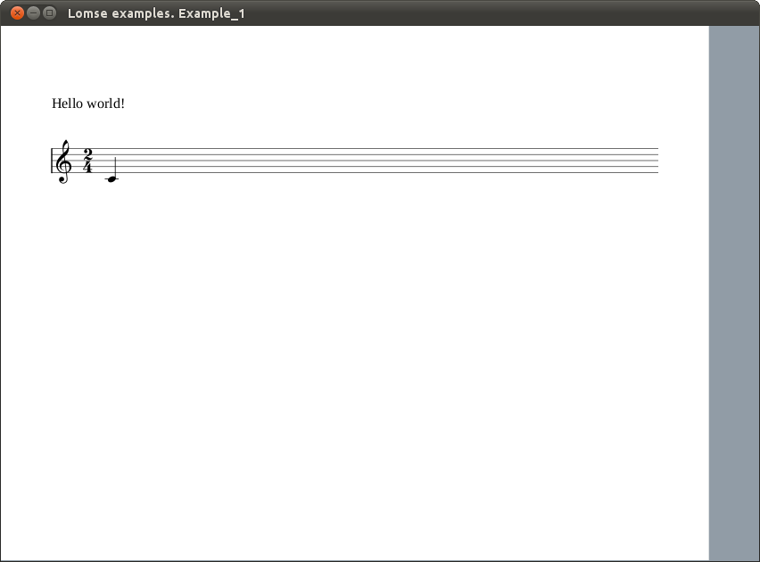

# Lomse library. Tutorial 1 for X11

This is meant to be an introduction to using Lomse in a X11 program. Before starting, ensure that you have installed the Lomse library. See the [installation](https://github.com/lenmus/lomse/wiki/Installation) page for detailed instructions.

In this first example we are just going to open a window and display the text "Hello world!" and an score on it. The full source code for this tutorial is in file tutorial-1-x11.cpp. After building the program and running it you will see something as:




## <a name="" />Table of content

- [How does Lomse work](#lomse)
- [Header files to use Lomse](#headers)
- [Important variables](#variables)
- [The application: main function](#main)
- [Initialize X11, create the rendering buffer and the main window](#init-x11)
- [Lomse initialization](#init-Lomse)
- [Creating the score and the View](#open-document)
- [The main loop for handling events](#main-loop)
- [Handling Lomse events and painting the window](#events)
- [Closing the application](#close)
- [Compiling your code and building](#compile)
- [Conclusions](#conclusions)


## <a name="lomse" />How does Lomse work

In this first example we are just going to open a window and display an score on it. The first and most important thing to learn about Lomse is that is platform independent code, with no knowledge about your platform native windows, that is, Lomse knows nothing about Linux, X11, or windows. Therefore, **Lomse can not render scores on windows.**

Lomse works by rendering the scores on a bitmap buffer, that is, on an array of consecutive memory bytes. As this buffer is provided by the user application, it can be any type of memory, such as a real bitmap, a window's buffer, etc. This implies that before using Lomse you should decide what is the best approach for using Lomse in your application.

The simplest and usual way of rendering scores on a window is just passing Lomse a bitmap in memory, asking Lomse to render on that bitmap, and copying the bitmap onto the window. And this is the approach we will follow for our X11 application.

For displaying a score the work to do is minimal:

1.  Initialize the Lomse library,
2.  Pass Lomse the source code for the score to render and a bitmap. Lomse will render the score on the bitmap.
3.  Finally, open a window and display the bitmap on it

In this example, the source code for the score is embedded in the code. In a real program you normally will read a file containing the score to display or you will create, by program, the source code for the score.

Let's start programming.


## <a name="headers" />Header files to use Lomse

Before we get into the heart of our basic example, I'll touch on a couple of mundane but nevertheless important details. The first is the X11 header files. Pay attention to order, because it is important. Here are the header files required to do much of anything in X, as well as some C++ headers that we will use:

```c++
// header files required for X11\. The order is important:
#include <X11/Xlib.h>
#include <X11/Xutil.h>
#include <X11/Xos.h>

//some additional needed stuff
#include <stdio.h>
#include <stdlib.h>
```

Next, we will define the Lomse headers. At the time of writing this the Lomse API is not yet fixed; therefore there is not a single header file (or set of headers) to include. Instead, the headers to include will depend on the classes and functions you would like to use. Anyway, with current API you will always include:

```c++
#include <lomse_doorway.h>
#include <lomse_document.h>
#include <lomse_graphic_view.h>
#include <lomse_interactor.h>
#include <lomse_presenter.h>
#include <lomse_events.h>

using namespace Lomse;
```

`LomseDoorway` is the main interface with the Lomse library. `Document` represents the score to display and is part of the Lomse Model-View-Controller (MVC) architecture. `GraphicView` represents the View (the window in which the score is going to be displayed). `Interactor` is the Controller for the View. `Presenter` is also part of the MVC model, and is responsible for maintaining the relationships between a Document and its different Views and associated interactors. Finally, `lomse_events.h` is required to deal with events received from the Lomse library.

These header files can be typically found in `/usr/local/include/Lomse`.


## <a name="variables" />Important variables

In this first example we are just going to display an score on the main window. For this, we need to define some Lomse related variables:

```c++
LomseDoorway    m_lomse;        //the Lomse library doorway
Presenter*      m_pPresenter;   //relates the View, the Document and the Interactor
```

Lomse knows nothing about X11 windows, so the Lomse View renders its content on a bitmap. To manage it, we define a pointer to the memory that we will use for the bitmap, and variables to save its size:

```c++
unsigned char*      m_buf_window = nullptr;     //memory for the bitmap
int                 m_bufWidth, m_bufHeight;    //bitmap size
```

Next, we define some X11 related variables for managing the bitmap:

```c++
XImage*             m_ximg_window;      //the image to display
int                 m_depth;            //color depth
Visual*             m_visual;           //X11 Visual to use
```

Lomse can manage a lot of bitmap formats and pixel formats. Therefore, you must define the format that you are going to use. Let's define some variables for these values:

```c++
int              m_byte_order;  //endian (platform byte ordering)
EPixelFormat     m_format;      //bitmap format (Lomse enum)
unsigned         m_bpp;         //bits per pixel
```

Finally, we will define other variables that our program will use:

```c++
//All typical X stuff needed to run the program and the main events handler loop,
//as well as for handling windows:
Display*    m_pDisplay;     //points to the X Server.
int         m_screen;       //refers to which screen of the display to use.
Window      m_window;       //the actual window itself
GC          m_gc;           //And the GC is the graphics context.
Atom        m_close_atom;
XSetWindowAttributes m_window_attributes;

//some additinal variables
bool    m_view_needs_redraw;      //to control when the View must be re-drawn
```


## <a name="main" />The application: main function

Let's move to the end of the program for looking at the main() function. It is very simple:

1.  Initialize the X11 system and create the rendering buffer and the main window.
2.  Initialize the Lomse library,
3.  Create an score, open a view to display it, and connect the View to the created window.
4.  Finally, run the main events handling loop, for processing events, until the user request to close the application.

Here is the code:

```c++
int main ()
{
    if (!init_x())
        exit(1);

    initialize_lomse();

    //create a music score and a View. The view will display the score
    //when the paint event is sent to Lomse, once the main windows is
    //shown and the event handling loop is started
    open_document();

    //run the main events handling loop
    define_events_to_process();
    handle_events();

    //delete the view and the rendering buffer
    delete_rendering_buffer();
    delete m_pPresenter;    //this will also delete the Doc, the Views and all other stuff

    //close X connection
    close_x();

    return 0;
}
```

Let's see in detail these steps.


## <a name="init-x11" />Initialize X11, create the rendering buffer and the main window

Most of it is typical X11 stuff. Look at the code:

```c++
bool init_x()
{
    //returns false if an error occurs

    //create X connection
    m_pDisplay = XOpenDisplay(nullptr);
    if(m_pDisplay == 0)
    {
        fprintf(stderr, "Unable to open DISPLAY!\n");
        return false;
    }

    m_screen = XDefaultScreen(m_pDisplay);

    //As Lomse renders on a bitmap it is necessary to determine the best
    //bitmap format suited for your specific OS and platform
    if (!determine_suitable_bitmap_format())
        return false;

    create_main_window(850, 600);       //850 x 600 pixels
    create_rendering_buffer(850, 600, 0);

    XMapWindow(m_pDisplay, m_window);

    m_close_atom = XInternAtom(m_pDisplay, "WM_DELETE_WINDOW", false);

    XSetWMProtocols(m_pDisplay, m_window, &m_close_atom, 1);
    return true;        //no error
}
```

The interesting part, near the middle, is the creation of the rendering buffer. As the comment says, it is necessary to decide which bitmap format we are going to use. It would have been possible to choose a common, widely supported format, such as bitmaps in RGBA format, 8 bits per pixel. These are typical values valid for most Linux systems. Nevertheless, for your convenience, this sample code includes a function for selecting a suitable bitmap format by determining the available X11 Visuals. This method has been borrowed from examples in AGG project.

```c++
if (!determine_suitable_bitmap_format())
    return false;
```

It returns `false` if no suitable bitmap format is found. Otherwise, global variables `m_depth` (the color depth to use), `m_visual` (the X11 Visual to use), `m_format` (a Lomse enum describing the bitmap format) and `m_byte_order` (the endian or byte ordering for this platform) are set.

Once a suitable bitmap format is determined, we find the following sentences:

```c++
create_main_window(850, 600);       //850 x 600 pixels
create_rendering_buffer(850, 600, 0);
```

`create_main_window()` is just typical X11 stuff. But the following line, `create_rendering_buffer()`, requires some explanation. As said, Lomse does not deal with X11 windows. Lomse just renders bitmaps. In our application, what we are going to do is to create a bitmap having the same size than the window and, then, when Lomse renders the score in the provided bitmap, we will just copy it to the window. Method `create_rendering_buffer()` takes care of creating a bitmap with the same size than the window. For this reason, we will also invoke this method when the window is resized. Here is the code:

```c++
bool create_rendering_buffer(unsigned width, unsigned height, unsigned flags)
{
    //allocate memory for the bitmap, fill it with 1's
    m_bufWidth = width;
    m_bufHeight = height;
    m_buf_window = new unsigned char[width * height * (m_bpp / 8)];
    memset(m_buf_window, 255, width * height * (m_bpp / 8));

    //create an X11 image using the allocated memory as buffer
    m_ximg_window = XCreateImage(m_pDisplay,
                                 m_visual,
                                 m_depth,
                                 ZPixmap,
                                 0,
                                 (char*)m_buf_window,
                                 width,
                                 height,
                                 m_bpp,
                                 width * (m_bpp / 8)
                                );
    m_ximg_window->byte_order = m_byte_order;

    //raise flag to redraw window when requested
    m_view_needs_redraw = true;

    return true;
}
```

In it, we basically allocate memory for the bitmap, and associate it to the X11 image to be displayed in the window.


## <a name="init-Lomse" />Lomse initialization

Once X11 is initialized and the main window and the rendering buffer are created, the next step is to initialize the Lomse library. This is just informing Lomse about the bitmap format to use and other options. In our example, we are going to use a display with a resolution of 96 ppi. In a real application, probably you should get this value by invoking some operating system related method to get the screen resolution. In any case, this value is not important because Lomse uses vectorial graphics for all, typography included and, thus, your application can always scale the image to as much resolution as you like. Nevertheless, Lomse requires a screen resolution value to adjust internal scaling factors so that when your application sets the scale to 1.0 (100%) the document get displayed on the screen at real size. If this is not a requirement for your application, any typical value can be used (e.g. 72, 96, 144, ...).

 So let's initialize Lomse. Here is the full code:

```c++
void initialize_lomse()
{
    //initialize the Lomse library
    m_lomse.init_library(m_format, 96);   //resolution=96 ppi

    //initialize Lomse related variables
    m_pInteractor = nullptr;
    m_pPresenter = nullptr;
}
```

## <a name="open-document" />Creating the score and the View

Next step in `main()` is invoking `open_document()` function. This is the typical method in which your application should open a dialog for requesting the file to open, and then, processing and displaying it. In our example, the score is predefined in a string, so we just request Lomse to create a new document with the specified content. When creating a document, Lomse automatically, creates a View to display it and an Interactor (a kind of Controller for the View). The `open_document()` code is as follows:

```c++
void open_document()
{
    //Normally you will load the content of a file. But in this
    //simple example we will create an empty document and define its content
    //from a text string

    //create a document and get the 'presenter'.
    //The Presenter takes care of creating and maintaining all objects
    //and relationships between the document, its views and the interactors
    //to interact with the view
    delete m_pPresenter;
    m_pPresenter = m_lomse.new_document(k_view_vertical_book,
        "(lenmusdoc (vers 0.0)"
            "(content "
                "(para (txt \"Hello world!\"))"
                "(score (vers 1.6) "
                    "(instrument (musicData (clef G)(key C)(time 2 4)(n c4 q) )))"
            ")"
        ")",
        Document::k_format_ldp);

    //get the pointer to the interactor and register for receiving desired events
    if (SpInteractor spInteractor = m_pPresenter->get_interactor(0).lock())
    {
        spInteractor->add_event_handler(k_update_window_event, update_window);
    }
}
```

The `Presenter` is the key object that relates a Document with its Views and Interactors. Also is the access point to get pointers to the Document and its Interactors. Deleting the Presenter also deletes all other related objects.

For creating the Presenter (and associated objects) we invoke LomseDoorway method `new_document()`, passing as arguments, the type of View to create and the content for the document (note: there are other methods, oriented to create the View from a file or programatically, but we will not study them in this simple example).

The View type is just a Lomse enum. In this example, value `k_view_vertical_book` means that we would like to display the score as book pages, one page after the other in a vertical layout. Other View formats are possible out-of-the-box, such as horizontal book or not paginated (the score in a single system) but, in any case, its not complex to develop your own View format.

The next parameter is a C string containing the score, and the last parameter is a constant `Document::k_format_ldp` that specifies the language in this score is written. In this example it is written in LenMus LDP language, but Lomse also supports other formats, such as MusicXML.

Let's analyse the string with the score. Fort this, I will split it into lines:

```c++
(lenmusdoc (vers 0.0)
    (content
        (para (txt "Hello world!"))
        (score (vers 1.6)
            (instrument
                (musicData
                    (clef G)
                    (key C)
                    (time 2 4)
                    (n c4 q)
                )
            )
        )
    )
)
```

First line means that it is a LenMus document, with version 0.0 format. Next line describes the content of the document. The content is just two elements: a paragraph ('para' element) containing text "Hello world!" and a 'score' element. Other types of content are possible: headers, images, tables, lists, etc. You can see LenMus documents as HTML documents, but allowing also a new type of content: scores.

The score element contains one instrument (this implies, by default, one staff). Finally, element 'musicData' describes the content for this instrument. In the example, a G clef, a C key signature, a 2/4 time signature and a quarter C4 note.

For a detailed description of the LDP language see the [LDP Reference Manual](https://lenmus.github.io/ldp/).

Once the Document and a View for it are created, we just get pointers to the Interactor, so that we can 'communicate' with the Document and its View. But Presenter returns a weak_pointer that has to be converted to a valid pointer before using it:

```c++
//get the pointer to the interactor, set the rendering buffer and register for
//receiving desired events
if (SpInteractor spInteractor = m_pPresenter->get_interactor(0).lock())
{
```

Lomse architecture is based on the Model-View-Controller pattern, and supports multiple simultaneous Views for a Document. By default, when creating a Document also a View and its associated Interactor are created. So, parameter `'0'` in `get_interactor(0)` refers to first Interactor, in this case, the only one created.

Once we've got the Interactor we have to set up a handler for receiving Lomse events related to the associated View:

```c++
spInteractor->add_event_handler(k_update_window_event, update_window);
```

In this example, we are interested in receiving a notification each time the View changes, so that we can display the updated bitmap in the window. We will see this in more detail later.


## <a name="main-loop" />The main loop for handling events

After creating the Document and the View the only thing to do is to wait for events, that is, to run the main loop for handling events. In this simple project, the only relevant ones are paint events and quit events. Here is the code, but I will not comment it as it is typical X11 stuff and you should know it better than me!:

```c++
void define_events_to_process()
{
    XSelectInput(m_pDisplay, m_window, ExposureMask | StructureNotifyMask );
}

int handle_events()
{
    XFlush(m_pDisplay);

    bool quit = false;
    while(!quit)
    {
        if(m_view_needs_redraw)
        {
            update_view_content();
            do_update_window();
            m_view_needs_redraw = false;
        }

        XEvent event;
        XNextEvent(m_pDisplay, &event);

        switch(event.type)
        {
            //--------------------------------------------------------------------
            case ConfigureNotify:
            {
                if(event.xconfigure.width  != m_bufWidth ||
                   event.xconfigure.height != m_bufHeight)
                {
                    int width  = event.xconfigure.width;
                    int height = event.xconfigure.height;
                    delete_rendering_buffer();
                    create_rendering_buffer(width, height, 0);
                    do_update_window();
                }
                break;
            }

            //--------------------------------------------------------------------
            case Expose:
                if (event.xexpose.count == 0)
                {
                    display_view_content();
                    XFlush(m_pDisplay);
                    XSync(m_pDisplay, false);
                }
                break;

            //--------------------------------------------------------------------
            case ClientMessage:
                if(event.xclient.format == 32
                   && event.xclient.data.l[0] == int(m_close_atom) )
                {
                    quit = true;
                }
                break;
        }
    }

    return 0;
}
```


## <a name="events" />Handling Lomse events and painting the window

In function `open_document()` we have created a Lomse Documents and it associated View. We also set up a callback for receiving events related to this View. But nothing has been displayed in the X11 window. We will study now how the score is displayed in the X11 window.

After invocation of `open_document()` our `main()` procedure enters in the events handling loop. There, the first thing the code does is to check flag `m_view_needs_redraw` to see if it is necessary to call Lomse for updating the bitmap. As the first time this condition is true, functions `update_view_content` and `do_update_window` get invoked, and flag `m_view_needs_redraw` is reset:

```c++
if(m_view_needs_redraw)
{
    update_view_content();
    do_update_window();
    m_view_needs_redraw = false;
}
```

Function `update_view_content` is just informing Lomse about the rendering buffer and ask it update the bitmap:

```c++
void update_view_content()
{
    //request the view to re-draw the bitmap

    if (!m_pPresenter) return;

    if (SpInteractor spInteractor = m_pPresenter->get_interactor(0).lock())
    {
        spInteractor->set_rendering_buffer(m_buf_window, m_bufWidth, m_bufHeight);
        spInteractor->redraw_bitmap();
    }
}
```

And `do_update_window` is just an invocation to `display_view_content`:

```c++
void do_update_window()
{
    // Invoking do_update_window() results in just putting immediately the content
    // of the currently rendered buffer to the window without neither calling
    // any Lomse methods nor generating platform related events (i.e. window on_paint)

    display_view_content();
    XSync(m_pDisplay, false);
}

void display_view_content(const rendering_buffer* rbuf)
{
    if(m_ximg_window == 0) return;

    //copy the view bitmap onto the image
    m_ximg_window->data = (char*)m_buf_window;

    //display the image
    XPutImage(m_pDisplay,
              m_window,
              m_gc,
              m_ximg_window,
              0, 0, 0, 0,
              rbuf->width(),
              rbuf->height()
             );
}
```

As you can see, we just copy the bitmap onto the X11 image and put this image in the window. That's all! We could have made the code more compact by writing just one function, but splitting the code into two different functions gives us the benefit of reusing the code when we need to repaint the window because receiving a paint event (Expose event, in X11 terminology). This is, for instance, the case when we receive a pain event from the operating system, because our window was damaged by another window and needs to be repainted. In this cases, it is enough to copy again the bitmap, as it is still valid and it is nor damaged. Therefore, when receiving an `Expose`event our application just invokes function `display_view_content`:

```c++
case Expose:
    if (event.xexpose.count == 0)
    {
        display_view_content();
        XFlush(m_pDisplay);
        XSync(m_pDisplay, false);
    }
    break;
```

`display_view_content` is also invoked whenever Lomse determines than the rendering buffer needs to be updated. In this cases, after updating the bitmap Lomse has to inform our application. To do it, the library creates a `k_update_window_event`. As we are subscribed to these events, our callback method, `update_window()` will be invoked. All we have to do in our event handler function is to display the bitmap in the desired window. This ensures that whenever something changes in the score the window is automatically updated. Here is the code:

```c++
void update_window(SpEventInfo pEvent)
{
    // Callback method for Lomse

    do_update_window();
}
```


## <a name="close" />Closing the application

Finally, the remaining code is just for housekeeping when the application finishes. The only important point to comment is to remind you that to avoid memory leaks it is necessary to delete the rendering buffer and the Presenter (which in turn will delete all Lomse related objects, such as the Document and the Interactor):

```c++
//delete the view and the rendering buffer
delete_rendering_buffer();
delete m_pPresenter;    //this will also delete the Doc, the Views and all other stuff
```

With this, I finish the explanation of the code. The full source code for this tutorial is in file **tutorial-1-x11.cpp**. In the next section we are going to build and run our sample.


## <a name="compile" />Compiling your code and building

Now for the fun (an sometimes troubling) part. Compiling your code and running it! Your proyect makefile must include the paths for the headers of used libraries: Lomse, X11 and the GNU Standard C++ Library (libstc++). The best way of doing it is by using the `pkg-config` tool:

```bash
`pkg-config --cflags x11` `pkg-config --cflags liblomse` -lstdc++
```

It will generate something as `-I/usr/include/freetype2 -I/usr/include/libpng12 -I/usr/include/lomse`.

As to the libraries to link, you only will have to include Lomse and X11\. Again, the best way of doing it is by using pkg-config tool. Open a terminal window, move to the directory containing the sample code and enter:

```bash
g++ -std=c++11 tutorial-1-x11.cpp -o tutorial-1-x11  \
    `pkg-config --cflags x11` `pkg-config --cflags liblomse`   \
    `pkg-config --libs liblomse` `pkg-config --libs x11` -lstdc++
```

And now, execute your first program using Lomse:

```bash
./tutorial-1-x11
```

You should see something as:


## <a name="conclusions" />Conclusions

This document is a very basic introduction. In the second tutorial I will add more code to our sample application for interacting with the score (zooming, dragging, selecting objects, etc.).

If you would like to contribute with more tutorials or by adapting this tutorial for other platforms, you are welcome!. Please open an issue or send a Pull Request. Thank you!
