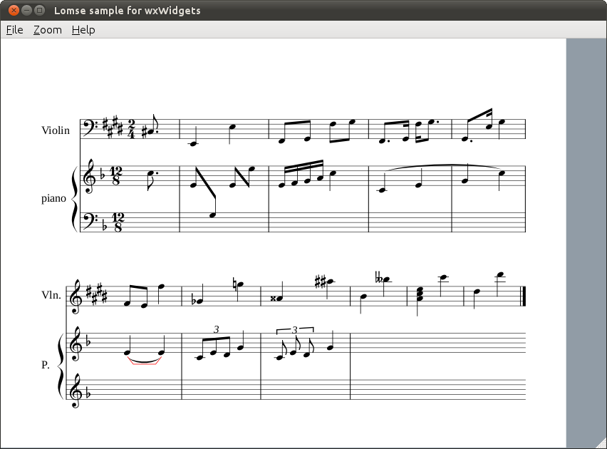

# Lomse library. Tutorial 2 for wxWidgets

In this second tutorial we are going to add more features to the simple application we developed in first tutorial. In particular, we will display scores stored in a file, and will add some interaction with the scores: zooming, dragging, and selecting objects.


## Table of contents

- [Specifications](#specifications)
- [Changes in <tt>MyFrame</tt> class](#myframe)
- [Handling keyboard events](#keyboard)
- [Handling mouse events](#mouse)
- [Events sent by Lomse](#paint)
- [Handling zooming commands](#zooming)
- [Loading scores from files](#loading)
- [Compiling your code and building](#compile)
- [Conclusions](#conclusions)


## <a name="specifications" />Specifications

We are going to use the code from tutorial 1 and add more functionality to it. First, let's define the new (arbitrary) specifications:

1.  A menu option for loading files with scores will be added.
2.  To interact with the score the user will have to use the keyboard and the mouse. For zooming, we will include options in main menu.
3.  The mouse will be used for two different tasks: dragging the score and selecting objects:
    *   In 'drag' mode, pressing the left mouse button will 'grasp' the score and any subsequent mouse movement will move the score following the mouse movements.
    *   In 'selection' mode, clicking the mouse will just select the pointed object. And pressing and dragging will draw a moving selection rectangle. When, finally, the mouse button is released, all objects inside the rectangle will be selected and the rectangle removed.
4.  To switch between mouse modes, in a real application the user will choose the desired tool, 'select' or 'move', probably by clicking on a toolbar with many tool icons. In our simple application, let's decide that task switching will be done by pressing keys on the keyboard:
    *   key 'D' will be used to switch to 'drag' mode.
    *   key 'S' to switch to 'selection' mode.
    *   When the program starts running, it will be in 'selection' mode.
5.  Let's define that key '+' will be used for zooming in. The zoom center will be at mouse cursor point.
6.  Finally, let's define that key '-' will be used for zooming out. Again, the zoom center will be at mouse cursor point.


## <a name="myframe" />Changes in <tt>MyFrame</tt> class

Having defined the specifications, the first thing we will do is to modify the main menu to add options for loading files and for zooming. This is usual wxWidgets stuff. We have to define IDs for these new menu items. For zooming we are going to use the standard wxWidgets IDs (wxID_ZOOM_IN and wxID_ZOOM_OUT) but for file open we define our own constant `k_menu_file_open`. After this, we modify our our `create_menu()` method as follows:

```c++
void MyFrame::create_menu()
{
    wxMenu *fileMenu = new wxMenu;
    fileMenu->Append(k_menu_file_open, _T("&Open..."));
    fileMenu->AppendSeparator();
    fileMenu->Append(k_menu_file_quit, _T("E&xit"));

    wxMenu* zoomMenu = new wxMenu;
    zoomMenu->Append(k_menu_zoom_in);
    zoomMenu->Append(k_menu_zoom_out);

    wxMenu *helpMenu = new wxMenu;
    helpMenu->Append(k_menu_help_about, _T("&About"));

    wxMenuBar* menuBar = new wxMenuBar;
    menuBar->Append(fileMenu, _T("&File"));
    menuBar->Append(zoomMenu, _T("&Zoom"));
    menuBar->Append(helpMenu, _T("&Help"));

    SetMenuBar(menuBar);
}
```

Now, we have to modify MyFrame class to add handlers for the new menu events. Remember that we also have to modify the events table:

```c++
EVT_MENU(k_menu_file_open, MyFrame::OnOpen)
EVT_MENU(k_menu_zoom_in, MyFrame::OnZoomIn)
EVT_MENU(k_menu_zoom_out, MyFrame::OnZoomOut)
```

The methods for handling these events are quite simple. For zoom-in and zoom-out events we just delegate on <tt>MyCanvas</tt>:

```c++
void MyFrame::OnZoomIn(wxCommandEvent& WXUNUSED(event))
{
    get_active_canvas()->zoom_in();
}

void MyFrame::OnZoomOut(wxCommandEvent& WXUNUSED(event))
{
    get_active_canvas()->zoom_out();
}
```

For open file events, we will display the standard dialog for choosing the file to open and then delegate on <tt>MyCanvas</tt>:

```c++
void MyFrame::OnOpen(wxCommandEvent& WXUNUSED(event))
{
    wxString defaultPath = wxT("../../../test-scores/");

    wxString filename = wxFileSelector(_("Open score"), defaultPath,
        wxEmptyString, wxEmptyString, wxT("LenMus files|*.lms;*.lmd"));

    if (filename.empty())
        return;

    get_active_canvas()->open_file(filename);
}
```

With this, we have finished with the modifications required for <tt>MyFrame</tt>.


## <a name="keyboard" />Handling keyboard events

Now let's got with the changes in <tt>MyCanvas</tt> class. The first thing to do is to add handlers for mouse and keyboard events. So, first we modify the events table to add:

```c++
EVT_KEY_DOWN(MyCanvas::OnKeyDown)
EVT_MOUSE_EVENTS(MyCanvas::OnMouseEvent)
```

And next, we create the handling methods. For dealing with key pressed events we add:

```c++
void MyCanvas::OnKeyDown(wxKeyEvent& event)
{
    if (!m_pInteractor) return;

    int nKeyCode = event.GetKeyCode();
    unsigned flags = get_keyboard_flags(event);

    //fix ctrol+key codes
    if (nKeyCode > 0 && nKeyCode < 27)
    {
        nKeyCode += int('A') - 1;
        flags |= k_kbd_ctrl;
    }

    //process key
    switch (nKeyCode)
    {
        case WXK_SHIFT:
        case WXK_ALT:
        case WXK_CONTROL:
            return;      //do nothing

        default:
            on_key(event.GetX(), event.GetY(), nKeyCode, flags);;
    }
}
```

Basically we get the key code and mouse coordinates when the key was pressed, and pass this information to function `on_key()` for doing whatever we would like. Let's see this method:

```c++
void MyCanvas::on_key(int x, int y, unsigned key, unsigned flags)
{
    switch (key)
    {
        case 'D':
            m_pInteractor->switch_task(TaskFactory::k_task_drag_view);
            break;
        case 'S':
            m_pInteractor->switch_task(TaskFactory::k_task_selection);
            break;
        case '+':
            m_pInteractor->zoom_in(x, y);
            force_redraw();
            break;
        case '-':
            m_pInteractor->zoom_out(x, y);
            force_redraw();
            break;
        default:
           return;
    }
}
```

It's trivial! Just use the Interactor to inform the View about the desired action and, when necessary, invoke a new method <tt>force_redraw()</tt> for updating the window with the updated image. The code in this method is trivial because the specifications fit perfectly on Interactor capabilities. What if we would like to colorize the score? Would it be as simple as just invoking:

```c++
m_pInteractor->colorize_score();
```

Of course it is not that simple!. But could be in future. Lomse aims at supporting not only document renderization and score playback but also document/score edition. The Interactor is the key object to interact with the document (here the name 'Interactor') and, currently, a lot of functionality is programmed for doing the most common tasks for renderization and playback. But for edition, I has just started. Simple things can be done but not many. As I am developing Lomse as part of the LenMus Phonascus application, Lomse is growing giving priority to Phonascus needs. Currently, all renderization and playback support needed by Phonascus is in place, and I am starting with score edition. If you would like to help, there are many programming tasks for you. Join the Lomse list and post a message. Thank you!

As to the `force_redraw()` method, it does two things: first, instructs the Lomse View to update the rendering buffer and, then, copies the updated bitmap into our window. here is the code:

```c++
void MyCanvas::force_redraw()
{
    update_view_content();
    update_window();
}
```


## <a name="mouse" />Handling mouse events

Next change is to add a handler method for dealing with mouse events. Here is the code:

```c++
void MyCanvas::OnMouseEvent(wxMouseEvent& event)
{
    if (!m_pPresenter) return;

    if (SpInteractor spInteractor = m_pPresenter->get_interactor(0).lock())
    {
        wxEventType nEventType = event.GetEventType();
        wxPoint pos = event.GetPosition();
        unsigned flags = get_mouse_flags(event);

        if (nEventType==wxEVT_LEFT_DOWN)
        {
            flags |= k_mouse_left;
            spInteractor->on_mouse_button_down(pos.x, pos.y, flags);
        }
        else if (nEventType==wxEVT_LEFT_UP)
        {
            flags |= k_mouse_left;
            spInteractor->on_mouse_button_up(pos.x, pos.y, flags);
        }
        else if (nEventType==wxEVT_RIGHT_DOWN)
        {
            flags |= k_mouse_right;
            spInteractor->on_mouse_button_down(pos.x, pos.y, flags);
        }
        else if (nEventType==wxEVT_RIGHT_UP)
        {
            flags |= k_mouse_right;
            spInteractor->on_mouse_button_up(pos.x, pos.y, flags);
        }
        else if (nEventType==wxEVT_MOTION)
            spInteractor->on_mouse_move(pos.x, pos.y, flags);
    }
}
```

The code for handling each mouse event type is similar. First, we invoke `event.GetPosition()` to get the mouse coordinates. Next, we invoke function `get_mouse_flags(event)` to get information about the keys the were pressed when the mouse event was created:

```c++
unsigned MyFrame::get_mouse_flags(wxMouseEvent& event)
{
    unsigned flags = 0;
    if (event.LeftIsDown())     flags |= k_mouse_left;
    if (event.RightIsDown())    flags |= k_mouse_right;
    if (event.MiddleDown())     flags |= k_mouse_middle;
    if (event.ShiftDown())      flags |= k_kbd_shift;
    if (event.AltDown())        flags |= k_kbd_alt;
    if (event.ControlDown())    flags |= k_kbd_ctrl;
    return flags;
}
```

Once all information is collected, we can just delegate in the library for dealing with mouse. This is because the two tasks, 'selection' and 'score dragging', are currently programmed in Lomse and, therefore, Lomse knows how to deal with mouse events for these two tasks. For instance, in 'selection' mode Lomse will draw a moving selection rectangle tracking mouse movements.

Two things to comment: First, the code is again very simple. The key for this simplicity is the task model build inside Lomse. So for common tasks, such as selection and dragging, your application has practically nothing to do. You only have to take care of designing and programming the GUI and Lomse will take care of everything else. As said, only tasks for renderization, playback and simple interaction are currently coded in Lomse. But for edition, I has just started.

The second issue is **very important**. I've said that, for instance, in 'selection' mode Lomse will draw a moving selection rectangle tracking mouse movements. But, how can Lomse draw anything on our window? Think for a while before continuing reading.

The answer is simple: that's not possible! Lomse can only update the bitmap in the rendering buffer but can not update our window. Therefore Lomse has to inform our application that the rendering buffer has been updated, so that our application can update the window or do whatever it likes. How this is done is explained in the next section.


## <a name="paint" />Events sent by Lomse

In real applications sometimes the rendering buffer will be updated by Lomse without being requested by the user application. For instance, in response to a mouse action some notes in the score has to be repainted in selected state. Or the whole score has to be displayed in another position because a drag operation. In these cases, Lomse automatically updates the bitmap and informs user application about the need to urgently repaint the window with the bitmap new content.

As Lomse is platform independent code, it knows nothing about <tt>wxPaintEvents</tt> or other application or platform dependent mechanisms for creating events. For this reason, your application is allowed to set up a callback and to request to be notified about certain events related to the Lomse View. To do it, when the Lomse View is created (in <tt>void MyCanvas::open_test_document()</tt> method), we have to add the following line (at the end of that method):

```c++
//ask to receive update_window events
m_pInteractor->add_event_handler(k_update_window_event, this, wrapper_update_window);
```

Whenever the rendering buffer is updated by Lomse in response to a user action, the library creates a `k_update_window_event`. As we have subscribed to these events, our callback method, `wrapper_update_window()` will be invoked. All we have to do in our event handler function is to display the bitmap in the desired window. This ensures that whenever something changes in the score, the window is automatically updated

It is very important to understand how the Lomse callback works. A call back is just a C function, **not a C++ class method**. As you know, to invoke an object's method you need a reference or pointer to the object, as in following examples:

```c++
object.method();
pObject->method();
```

The only exception to this is when the method is static. In this case you will directly invoke the method as in:

```c++
Object::method()
```

Therefore, to use a method as call back it is necessary to pass two parameters, a pointer to the object instance, and a pointer to the method. But as the Lomse callback is a C callback, only one parameter is passed: the pointer to the method. As a consequence, only static methods can be invoked. But this is a very strong limitation as static members can only access static variables.

This problem has no simple solution. The simplest one I have found, that works for both C and C++ programs, is to add another parameter to the function that sets up the callback. This parameter is a pointer to the object instance (for C++) or NULL (for C programs). The callback is still an static method but it will receive the object instance pointer as parameter and, thus, non-static members can be invoked from inside the static method.

This is the solution for our update window callback:

```c++
void MyCanvas::wrapper_update_window(void* pThis, SpEventInfo pEvent)
{
    static_cast<MyCanvas*>(pThis)->update_window();
}

void MyCanvas::update_window()
{
    // Invoking update_window() results in just putting immediately the content
    // of the currently rendered buffer to the window without neither calling
    // any lomse methods nor generating any events  (i.e. Refresh() window)

    wxClientDC dc(this);
    copy_buffer_on_dc(dc);
}
```


## <a name="zooming" />Handling zooming commands

In <tt>MyFrame</tt> we delegated all zooming operations by invoking two new methods, <tt>MyCanvas::zoom_in()</tt> and <tt>MyCanvas::zoom_in()</tt>. Therefore, we have now code these methods. They are very simple:

```c++
void MyCanvas::zoom_in()
{
    if (!m_pPresenter) return;

    //do zoom in centered on window center
    if (SpInteractor spInteractor = m_pPresenter->get_interactor(0).lock())
    {
        wxSize size = this->GetClientSize();
        spInteractor->zoom_in(size.GetWidth()/2, size.GetHeight()/2);
        force_redraw();
    }
}

void MyCanvas::zoom_out()
{
    if (!m_pPresenter) return;

    //do zoom out centered on window center
    if (SpInteractor spInteractor = m_pPresenter->get_interactor(0).lock())
    {
        wxSize size = this->GetClientSize();
        spInteractor->zoom_out(size.GetWidth()/2, size.GetHeight()/2);
        force_redraw();
    }
}
```

As you can see, it is just asking the Interactor, passing as arguments the zooming center point. Instead of placing the zooming center at mouse position, I've placed it at center of screen. It is just for illustrating other possibilities. Finally, I invoke <tt>force_redraw()</tt> in order to update the bitmap and redisplay it on the window. This could cause you some confusion as we learn in previous section that when Lomse updates the rendering buffer it creates a <tt>k_update_window_event</tt>. as we already subscribed to these events, it should not be necessary to take care of deciding to update the window after requesting a zooming operation.

The logic followed by Lomse to generate <tt>k_update_window_event</tt> is a little more complex (not very much). Lomse **only** generates <tt>k_update_window_event</tt> events when the user application can not foresee that the bitmap is updated. Otherwise, the event is not generated.

As the expected consequence of requesting a zoom-in or zoom-out is that the bitmap will be updated with the new zoomed image, Lomse does not generates a update event, transferring the user application the responsibility on deciding to update the window. On the contrary, when passing a mouse event to Lomse, the user application can not foresee if the mouse even will result in any changes in the bitmap; therefore, Lomse generates events when the bitmap gets updated by the implied mouse action.

The rationale for this design decision is to allow for certain window repaint optimization, by avoiding forcing updates in those cases in which the user application would like to request several consecutive changes on the score. For instance, if your application code request Lomse to rotate the image and then to zoom in, it would be better to repaint the bitmap and update the window after both operations are completed instead of forcing to do it after every operation. For this reason, Lomse only generates update events when the user application can not determine with certainty the consequences of the requested action.


## <a name="loading" />Loading scores from files

o finish our modifications we have to add code for loading scores from a file and rendering them. We learn in first tutorial how to load an score from a text string. Loading it from a file is equally simple. But instead of passing the string to Lomse, it is just passing the full filename and Lomse will take care of all details. In <tt>MyFrame</tt> we opened an auxiliary window for selecting the file to open, and delegated the load operation om a new method, <tt>MyCanvas::open_file(fullname)</tt>. The code for it is practically identical to the existing `open_test_document` method. Here is the code:

```c++
void MyCanvas::open_file(const wxString& fullname)
{
    //create a new View
    std::string filename( fullname.mb_str(wxConvUTF8) );
    delete m_pPresenter;
    m_pPresenter = m_lomse.open_document(k_view_vertical_book,
                                         filename);

    //get the pointer to the interactor, set the rendering buffer and register for
    //receiving desired events
    if (SpInteractor spInteractor = m_pPresenter->get_interactor(0).lock())
    {
        //connect the View with the window buffer
        spInteractor->set_rendering_buffer(&m_rbuf_window);

        //ask to receive desired events
        spInteractor->add_event_handler(k_update_window_event, this, wrapper_update_window);
    }

    //render the new score
    m_view_needs_redraw = true;
    Refresh(false /* don't erase background */);
}
```

Two are the differences with `open_test_document`:

1.  Instead of invoking <tt>m_lomse.new_document()</tt> and passing an string with the score, we invoke <tt>m_lomse.open_document()</tt> and pass the filename.
2.  The last line of this method is forcing a repaint of the new score. This was not necessary in `open_test_document` as it was the initial content for our window and, therefore, a paint event was going to be generated by <tt>wxWidgets</tt>.

And this is all. Our application is ready for building and testing.


## <a name="compile" />Compiling your code and building

Please, for details see instructions in Tutorial 1.

Open a terminal window and type (fix paths if necessary):

```bash
cd <projects>/lomse/examples/tutorials/tutorial-2-wx		# move to tutorial folder
g++ -std=c++11 tutorial-2-wx.cpp -o tutorial-2-wx    \
    `pkg-config --cflags liblomse` `wx-config --cflags`   \
    `pkg-config --libs liblomse` `wx-config --libs` \
    -lstdc++
```

And now, execute the program:

```bash
./tutorial-2-wx
```

I didn't say it but in method `open_test_document()` I've replaced the trivial score used in tutorial-1 by a more complex score. When executing tutorial-2 you should see something as:




Play with the mouse for dragging the score and for selecting objects. Test zooming by using the keys '+' and '-'. Open some scores. You will find many, used for Lomse tests, in "/lomse/test-scores/".


## <a name="conclusions">9\. Conclusions

In this tutorial I have started to introduce important concepts for interacting with our scores. In the third tutorial I will teach you to create scores by program.

If you would like to contribute with more tutorials or by adapting this tutorial for other platforms, you are welcome!. Please open an issue or send a Pull Request. Thank you!

