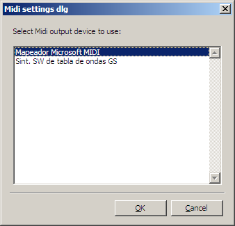
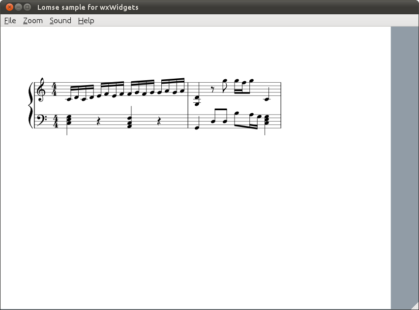

# Lomse library. Tutorial 3 for wxWidgets

In this third tutorial we are going to see how to add score playback capabilities to your application. The full source code for this tutorial is in file  **tutorial-3-wx.cpp**.


### Table of contents

- [How Lomse playback works](#playback-intro)
- [Specifications](#specifications)
- [Changes for using wxMidi](#wxmidi)
- [Definition and implementation of class MidiServer](#midi-server)
- [Initial dialog for Midi settings](#midi-dlg)
- [Testing sound](#testing-sound)
- [Additional menu items](#menu)
- [Creating ScorePlayer object](#score-player)
- [Creating the player GUI object](#mycanvas)
- [Other modifications in MyCanvas](#mycanvas)
- [Compiling your code and building](#compile)
- [Problems with MIDI sound in Linux](#sound-problems)
- [Conclusions](#conclusions)


## <a name="playback-intro" />How Lomse playback works

Lomse provides class <tt>ScorePlayer</tt>, that takes care of most of the work to do. By using it, playing an score is, basically, three tasks:

1.  Load the score to play in the <tt>ScorePlayer</tt> instance.
2.  Create a class, derived from <tt>PlayerGui</tt> for controling and defining the playback options (i.e. visual tracking, metronome settings, tempo speed, count-off, etc).
3.  Ask <tt>ScorePlayer</tt> to play it, using the desired options.

This is an excerpt of the needed code (more on it later):

```c++
//step 1: prepare for playing back the score
ImoScore* pScore = ...
ScorePlayer* pPlayer = ...
PlayerGui* pPlayerGui = ...
pPlayer->load_score(pScore, pPlayerGui);

//step2: go on
bool fVisualTracking = true;
m_pPlayer->play(fVisualTracking, 0, spInteractor.get());
```

<tt>PlayerGui</tt> is an interface between your application playback GUI controls and the Lomse library. By "playback GUI controls" I am referring to things such as a button, a menu item, or a link to ask for playing back the score, check boxes for specifying playback options, such as "generate metronome clicks" or "start with count off clicks", a slider for specifying tempo speed, etc. The simplest way for specifying an option (i.e. tempo speed for playing back the score) would be to pass its value directly to Lomse when asking to play the score. But this approach has a drawback: the chosen values can not be changed by the user while the score is being played. Therefore, instead of passing Lomse the values for options, the idea is to have an interface between Lomse and your application, so that Lomse can ask your application for these values when needed. More on this later.

The last line of previous code is invocation of <tt>play</tt> method. It will trigger all the playback machinery. But **Lomse will not generate any sounds**. Sound generation is always responsibility of your application. What Lomse will do is to generate _sound events_. Therefore, for playback, your application has three main responsibilities:

1.  Create a class, derived from <tt>PlayerGui</tt> for defining the playback options.
2.  Handle sound events
3.  Generate sound for each sound event

Tasks 2 and 3 are accomplished by creating, in your application, a class derived from <tt>MidiServerBase</tt>. This base class defines the interface for processing MIDI events. Your application has to define a derived class and implement the virtual methods. Your class will receive the sound events and will have the responsibility of generating the sounds. Lomse does not impose any restriction about sound generation other than low latency. Perhaps, the simpler method to generate sounds is to rely on the MIDI synthesizer of the PC sound card. But any other alternatives are possible. By the way, I would like to modify Lomse library to add an interface to the JACK audio system ( [http://jackaudio.org/](http://jackaudio.org/)). If you are interested in taking this task you are welcome. Please post me a message. Thank you!

<tt>ScorePlayer</tt> constructor requires an instance of the <tt>MidiServer</tt> to use:

```c++
MidiServer* pMidi = new MidiServer();
ScorePlayer* pPlayer = m_lomse->create_score_player(pMidi);
```

With this, all playback machinery is in place.

As to visual tracking effects (highlighting notes being played and/or displaying a vertical tempo line marking beats), Lomse will also post _score highlight_ events, to be handled by your application. By handling them you will have full control, and your application can create whatever fancy visual tracking effects you would like.

Nevertheless, Lomse implements standard visual effects so you can delegate in Lomse for generating visual effects. In this case, your application will just receive _update view_ events when the display should be updated, and all you have to do is to copy the already updated rendering bitmap onto the window. All the required code for updating the display is already included in code from tutorial 2.

Finally, for controlling playback some GUI controls (buttons, menu items, etc. to trigger start, stop, pause actions) are required. Lomse gives your application two options for this:

1.  The first one is to create your own play/pause/stop control mechanism. For instance, you could use menu items, buttons in the toolbar, etc. For linkinf these controls to Lomse you will have to define a class derived from <tt>PlayerGui</tt>. We will see how to do it later in this tutorial.
2.  The other alternative is to display, embedded the document, near the score, a _player control_ widget (the typical play/stop buttons, plus playback information that we see in many media players). Lomse has such control (class ScorePlayerCtrl) but this is an advanced topic that requires knowledge of Lomse controls and dynamic content creation. So, I will explain nothing about it in this tutorial.

So, as you can see, implementing score playback is simple, and the only burden for your application is coding a <tt>MidiServer</tt> class for generating the sounds.


## <a name="specifications" />Specifications

In this third tutorial we are going to see how to add score playback capabilities to your application. For controlling playback we are going to add some menu items (play, pause, stop) to the application main menu.

For sound generation we will use the [wxMidi component](https://github.com/lenmus/wxmidi). It is just a wrapper for using the PortMidi library in wxWidgets applications.

In this tuturial on score playback we will have to devote a lot of time to something not directly related to using Lomse: sound generation. Therefore, I will split this tutorial into two. In this tutorial we are not going to generate any visual tracking effects during playback. And we will do it in the fourth tutorial.

At program start we need to present user a dialog for choosing the midi synthesizer to use. We also have to add menu items for displaying again this settings dialog whenever the user likes to change Midi settings.

We are going to use the code from tutorial 2 and add more functionality to it. The changes to do are the following:

1.  Definitions for using wxMidi
2.  Definition and implementation of class MidiServer, for generating sounds.
3.  Initial dialog for Midi settings.
4.  Menu items for displaying dialog and for score playback: play, pause, stop.
5.  Modifications in <tt>MyFrame</tt> for displaying dialog at start up.
6.  Modifications in <tt>MyFrame</tt> for creating <tt>MidiServer</tt> and <tt>ScorePlayer</tt>.
7.  Modifications in <tt>MyFrame</tt> for dealing with 'Play', 'Pause' and 'Stop' menu items.
8.  Modifications in <tt>MyCanvas</tt> for score playback and for defining the player GUI.

Let's start programming.


## <a name="wxmidi" />Changes for using wxMidi

For your conveniece the wxMidi sources are already in the tutorial's tree, so you don't have to download them. The recommended approach for using wxMidi is to include wxMidi sources in your application source tree. wxMidi is just two .cpp files and one header file. In this tutorial we have the following source tree:

```
tutorials
   |
   +-- tutorial-3-wx
   |	   |
   |	   +-- tutorial-3-wx.cpp
   |
   +-- wxMidi
		   |
		   +-- wxMidi.cpp
		   +-- wxMidiDatabase.cpp
		   +-- wxMidi.h
```

Before compiling our tutorial, take into account that it is necessary to install the PortMidi library and link with it. Perhaps this is the right time to ensure that you have PortMidi installed in your system. See wxMidi install instructions, included in the wxMidi package.

Now, let's start modifying code from tutorial 2 by adding <tt>wxMidi</tt> headers and a couple of additional Lomse headers:

```c++
#include <lomse_player_gui.h>
#include <lomse_score_player.h>

//wxMidi headers
#include <wxMidi.h>
```


## <a name="midi-server" />Definition and implementation of class MidiServer

For using wxMidi we will define class <tt>MidiServer</tt>, derived from <tt>MidiServerBase</tt>- It will implement virtual methods, defined in base class, for creating sounds. Implementation of <tt>MidiServer</tt> is very simple as it is just using the services provided by <tt>wxMidi</tt> class. The definition of <tt>MidiServerBase</tt> class is in header lomse_score_player.h (add now this header to the tutorial code). The class is as follows:

```c++
class MidiServerBase
{
public:
    MidiServerBase() {}
    virtual ~MidiServerBase() {}

    virtual void program_change(int channel, int instr) {}
    virtual void voice_change(int channel, int instr) {}
    virtual void note_on(int channel, int pitch, int volume) {}
    virtual void note_off(int channel, int pitch, int volume) {}
    virtual void all_sounds_off() {}
};
```

Our derived class is quite simple. We will just define two pointers to keep references to the relevant <tt>wxMidi</tt> objects: <tt>wxMidiSystem</tt>, that represents the whole Midi synthesizer, and <tt>wxMidiOutDevice</tt>, that represents the output device, that is, the device that will create the sounds. I also have defined a couple of variables to contain current Midi configuration, and have added three helper methods. Here is the definition:

```c++
class MidiServer : public MidiServerBase
{
protected:
    wxMidiSystem*  m_pMidiSystem;       //MIDI system
    wxMidiOutDevice*  m_pMidiOut;       //out device object

    //MIDI configuration information
    int     m_nOutDevId;
    int     m_nVoiceChannel;

public:
    MidiServer();
    ~MidiServer();

    //get number of available Midi devices
    int count_devices();

    //set up configuration
    void set_out_device(int nOutDevId);

    //create some sounds to test Midi
    void test_midi_out();

    //mandatory overrides from MidiServerBase
    void program_change(int channel, int instr);
    void voice_change(int channel, int instr);
    void note_on(int channel, int pitch, int volume);
    void note_off(int channel, int pitch, int volume);
    void all_sounds_off();
};
```

Implementation is very simple. The constructor is just initializing variables and getting the address of the <tt>wxMidiSystem</tt> object. This object represents the whole Midi interface. This is the code:

```c++
MidiServer::MidiServer()
    : m_pMidiSystem( wxMidiSystem::GetInstance() )
    , m_pMidiOut(nullptr)
    , m_nOutDevId(-1)
    , m_nVoiceChannel(0)    // 0 based. So this is channel 1
{
}
```

The destructor is just closing the out device and deleting the <tt>wxMidi</tt> related objects:

```c++
MidiServer::~MidiServer()
{
    if (m_pMidiOut)
        m_pMidiOut->Close();

    delete m_pMidiOut;
    delete m_pMidiSystem;
}
```

Apart from the mandatory virtual methods, I have added three new methods. First one, <tt>count_devices</tt> is getting the number of Midi devices installed in your PC. We need it for the Midi settings dialog. This is the code:

```c++
int MidiServer::count_devices()
{
    return m_pMidiSystem->CountDevices();
}
```

Next one, <tt>set_out_device</tt>, is for choosing the device that will be used for generating sounds. We will use it also in the Midi settings dialog. The basic code is just creating a <tt>wxMidiOutDevice</tt> instance:

```c++
m_pMidiOut = new wxMidiOutDevice(m_nOutDevId);
```

But the real code is just slightly more complex due to error checking and to allowing the user for changing Midi settings multiple times. This is the code:

```c++
void MidiServer::set_out_device(int nOutDevId)
{
    wxMidiError nErr;

    //if out device Id has changed close current device and open the new one
    if (!m_pMidiOut || (m_nOutDevId != nOutDevId))
    {
        //close current device
         if (m_pMidiOut)
         {
            nErr = m_pMidiOut->Close();
            delete m_pMidiOut;
            m_pMidiOut = nullptr;
            if (nErr)
            {
                wxMessageBox( wxString::Format(
                    _T("Error %d while closing Midi device: %s \n")
                    , nErr, m_pMidiSystem->GetErrorText(nErr).c_str() ));
                return;
            }
        }

        //open new one
        m_nOutDevId = nOutDevId;
        if (m_nOutDevId != -1)
        {
            try
            {
                m_pMidiOut = new wxMidiOutDevice(m_nOutDevId);
                nErr = m_pMidiOut->Open(0, nullptr);        // 0 latency, no driver user info
            }
            catch(...)      //handle all exceptions
            {
                wxLogMessage(_T("[MidiServer::set_out_device] Crash opening Midi device"));
                return;
            }

            if (nErr)
                wxMessageBox( wxString::Format(
                    _T("Error %d opening Midi device: %s \n")
                    , nErr, m_pMidiSystem->GetErrorText(nErr).c_str() ));
            else
                wxMessageBox(_T("Midi out device correctly set."));
        }
    }
}
```

Finally, I have added a test method for generating some sounds, to be used for checking that Midi settings are valid and the Midi interface works. This is useful for checking the Midi system if score playback doesn't produce sounds. Here is the code:

```c++
void MidiServer::test_midi_out()
{
    if (!m_pMidiOut) return;

    //Play a scale
    int scale[] = { 60, 62, 64, 65, 67, 69, 71, 72 };
    #define SCALE_SIZE 8

    for (int i = 0; i < SCALE_SIZE; i++)
    {
        m_pMidiOut->NoteOn(m_nVoiceChannel, scale[i], 100);
        ::wxMilliSleep(200);    // wait 200ms
        m_pMidiOut->NoteOff(m_nVoiceChannel, scale[i], 100);
    }
}
```

And now we will implement the required virtual methods. This is the simplest part. Here is the code:

```c++
void MidiServer::program_change(int channel, int instr)
{
    m_pMidiOut->ProgramChange(channel, instr);
}

void MidiServer::voice_change(int channel, int instrument)
{
    m_nVoiceChannel = channel;
    if (m_pMidiOut)
    {
        wxMidiError nErr = m_pMidiOut->ProgramChange(channel, instrument);
        if (nErr)
        {
            wxMessageBox( wxString::Format(
                _T("Error %d in ProgramChange:\n%s")
                , nErr, m_pMidiSystem->GetErrorText(nErr).c_str() ));
        }
    }
}

void MidiServer::note_on(int channel, int pitch, int volume)
{
    m_pMidiOut->NoteOn(channel, pitch, volume);
}

void MidiServer::note_off(int channel, int pitch, int volume)
{
    m_pMidiOut->NoteOff(channel, pitch, volume);
}

void MidiServer::all_sounds_off()
{
    m_pMidiOut->AllSoundsOff();
}
```

With this we have finished the longest part: creating our sound generator based on <tt>wxMidi</tt>. Now we have to modify <tt>MyFrame</tt> class for using it. We will modify <tt>MyFrame</tt> definition by adding a pointer to <tt>MidiServer</tt> instance and an accessor method for creating the instance, if not created, and returning it.

First, changes in <tt>MyFrame</tt> definition:

```c++
class MyFrame: public wxFrame
{
    ...
protected:
    ...
    //sound related
    MidiServer* get_midi_server();

    MidiServer* m_pMidi;
    ...
```

And now the implementation. First, we modify <tt>MyFrame</tt> constructor to initialize <tt>m_pMidi</tt> to <tt>nullptr</tt>. and we modify destructor to delete it. Finally, we define the accessor method:

```c++
MidiServer* MyFrame::get_midi_server()
{
    if (!m_pMidi)
        m_pMidi = new MidiServer();
    return m_pMidi;
}
```

With this, we have all necessary changes for using Midi. The only missing issue is the initial dialog to set Midi device. We will deal with it in next section.


## <a name="midi-dlg" />Initial dialog for Midi settings

To reduce the size of the tutorial code, instead of coding our own dialog, we will use function <tt>::wxGetSingleChoiceIndex</tt>. It pops up a dialog box containing a message, 'OK' and 'Cancel' buttons and a single-selection listbox. In this listbox the user will select the Midi output device. All other Midi settings will be defaulted to wxMidi default values. In a real application you will have to code a better dialog, including more Midi parameters and other options.

```c++
void MyFrame::show_midi_settings_dlg()
{
    wxArrayString outDevices;
    vector <int>deviceIndex;

    //get available Midi out devices
    MidiServer* pMidi = get_midi_server();
    int nNumDevices = pMidi->CountDevices();
    for (int i = 0; i < nNumDevices; i++)
    {
        wxMidiOutDevice device(i);
        if (device.IsOutputPort())
        {
            outDevices.Add( device.DeviceName() );
            deviceIndex.push_back(i);
        }
    }

    int iSel = ::wxGetSingleChoiceIndex(
                    _T("Select Midi output device to use:"),    //message
                    _T("Midi settings dlg"),                    //window title
                    outDevices,
                    this                                        //parent window
                 );
    if (iSel == -1)
    {
        //the user pressed cancel
        //
    }
    else
    {
        //set current selection
        MidiServer* pMidi = get_midi_server();
        int deviceID = deviceIndex[iSel];   //output device
        pMidi->SetOutDevice(deviceID);
    }
}</int> ```

Now, I will modify <tt>MyFrame</tt> constructor to invoke this method:

```c++
MyFrame::MyFrame()
    : wxFrame(nullptr, wxID_ANY, _T("Lomse sample for wxWidgets"),
              wxDefaultPosition, wxSize(850, 600))
    , m_pMidi(nullptr)
{
    create_menu();
    initialize_lomse();
    show_midi_settings_dlg();
    ...
```

Next, we will add menu items for displaying the Midi settings dialog and for testing the Midi interface. All these new items will be arranged under a 'Sound' submenu. This is usual wxWidgets stuff. We have to define IDs for these new menu items (`k_menu_midi_test` and `k_menu_midi_settings`). After this, we modify our our `create_menu()` method as follows:

```c++
...
wxMenu *soundMenu = new wxMenu;
soundMenu->Append(k_menu_midi_settings, _T("&Midi settings"));
soundMenu->Append(k_menu_midi_test, _T("Midi &test"));
...
menuBar->Append(soundMenu, _T("&Sound"));
```

Now, we have to modify MyFrame class to add handlers for the new menu events. Remember that we also have to modify the events table:

```c++
EVT_MENU(k_menu_midi_settings, MyFrame::on_midi_settings)
EVT_MENU(k_menu_midi_test, MyFrame::on_sound_test)
```

Finally, we code these two methods:

```c++
void MyFrame::on_midi_settings(wxCommandEvent& WXUNUSED(event))
{
    show_midi_settings_dlg();
}

void MyFrame::on_sound_test(wxCommandEvent& WXUNUSED(event))
{
    MidiServer* pMidi = get_midi_server();
    if (!pMidi) return;
    pMidi->test_midi_out();
}
```


## <a name="testing-sound" />Testing sound

Now, compile and build the tutorial code (see section [Compiling your code and building](#compile)). It is not yet finished but we can test our Midi interface. When running the program the first thing you will see is the Midi settings dialog, a window similar to one of these:

 

In these images, you can see the Midi devices created by *Timidity* software in my Linux system and the Midi devices in my old Windows XP system. In Windows, choose any of the devices. In Linux choose one of the *Timidity* ports 0 to 4, but not the midi through port!

After choosing the desired device and clicking on button 'Ok' you will get the main frame, displaying an score. In main menu, you will get a new item 'Sound'. Click on it and select item 'Test Midi'. If everything is ok you should hear an scale. If not, check the sound settings of your computer. The most frequent cause for not hearing any sound is that the Midi synthesizer output is disabled! If you are running the tutorial on Linux see ["Problems with MIDI sound in Linux"](#sound-problems).

Once the Midi test is passed, we are ready to continue with more changes in our program.


## <a name="menu" />Additional menu items

Now we will add menu items for score playback: 'Play', 'Pause' and 'Stop'. All these new items will be arranged under the 'Sound' submenu. This is usual wxWidgets stuff. We have to define IDs for these new menu items (`k_menu_play_start`, `k_menu_play_stop` and `k_menu_play_pause`). After this, we modify our our `create_menu()` method as follows:

```c++
wxMenu *soundMenu = new wxMenu;
soundMenu->Append(k_menu_play_start, _T("&Play"));
soundMenu->Append(k_menu_play_stop, _T("&Stop"));
soundMenu->Append(k_menu_play_pause, _T("Pause/&Resume"));
soundMenu->Append(k_menu_midi_settings, _T("&Midi settings"));
soundMenu->Append(k_menu_midi_test, _T("Midi &test"));
...
menuBar->Append(soundMenu, _T("&Sound"));
```

Now, we have to modify MyFrame class to add handlers for the new menu events. Remember that we also have to modify the events table:

```c++
EVT_MENU(k_menu_play_start, MyFrame::on_play_start)
EVT_MENU(k_menu_play_stop, MyFrame::on_play_stop)
EVT_MENU(k_menu_play_pause, MyFrame::on_play_pause)
```

The methods for handling these events are quite simple as we just delegate on <tt>MyCanvas</tt>:

```c++
void MyFrame::on_play_start(wxCommandEvent& WXUNUSED(event))
{
    get_active_canvas()->play_start();
}

void MyFrame::on_play_stop(wxCommandEvent& WXUNUSED(event))
{
    get_active_canvas()->play_stop();
}

void MyFrame::on_play_pause(wxCommandEvent& WXUNUSED(event))
{
    get_active_canvas()->play_pause();
}
```


## <a name="score-player" />Creating ScorePlayer object

Before coding the necessary changes in <tt>MyCanvas</tt> it is necessary to create the <tt>ScorePlayer</tt> object. It should be a global object, accessible from any point at which it is necessary to play an score. In our simple tutorial, I will put this object as member of <tt>MyFrame</tt> and will pass it to <tt>MyCanvas</tt> in the constructor. Therefore, I will change <tt>MyFrame</tt> declaration to define a member variable and a getter method:

```c++
class MyFrame: public wxFrame
{
    ...
protected:
    ...
    //sound related
    ...
    ScorePlayer* get_score_player();

    ScorePlayer* m_pPlayer;
    ...
```

In <tt>MyFrame</tt> constructor the new variable <tt>m_pPlayer</tt> is initialized to <tt>nullptr</tt>, and the <tt>ScorePlayer</tt> creation is delayed until really needed:

```c++
ScorePlayer* MyFrame::get_score_player()
{
    if (!m_pPlayer)
    {
        MidiServer* pMidi = get_midi_server();
        m_pPlayer = m_lomse.create_score_player(pMidi);
    }
    return m_pPlayer;
}
```

Finally, we modify <tt>MyCanvas</tt> definition for receiving the <tt>ScorePlayer</tt> object in constructor:

```c++
class MyCanvas : public wxWindow
{
public:
    MyCanvas(wxFrame *frame, LomseDoorway& lomse, ScorePlayer* pPlayer);
    ...
protected:
    ...
    // for score playback
    ScorePlayer* m_pPlayer;

MyCanvas::MyCanvas(wxFrame *frame, LomseDoorway& lomse, ScorePlayer* pPlayer)
    : wxWindow(frame, wxID_ANY)
    , m_lomse(lomse)
    , m_pPresenter(nullptr)
    , m_buffer(nullptr)
    , m_pPlayer(pPlayer)
    , m_view_needs_redraw(true)
{
}
```

And we modify the code for passing the <tt>ScorePlayer</tt> object when <tt>MyCanvas</tt> instances are created, in <tt>MyFrame</tt> constructor:

```c++
MyFrame::MyFrame()
    : wxFrame(nullptr, wxID_ANY, _T("Lomse sample for wxWidgets"),
              wxDefaultPosition, wxSize(850, 600))
    , m_pMidi(nullptr)
    , m_pPlayer(nullptr)
{
    ...
    // create our one and only child -- it will take our entire client area
    m_canvas = new MyCanvas(this, m_lomse, get_score_player());
    ...
```

With this, we have finished with the modifications required for <tt>MyFrame</tt>.


## <a name="mycanvas" />Creating the player GUI object

I have defined some items for score playback: 'Play', 'Pause' and 'Stop', in the 'Sound' submenu. But, as I would like to keep this tutorial simple, I have not created other GUI widgets for controlling playback. In a real application you, probably, would like to have additional feautures, such as checkboxes for deciding wether to have metronome clicks enabled, to produce some coount off metronome clicks, to have volume and tempo sliders, etc.

To inform Lomse about these controls and about the options fof playback you have to define a class, derived from <tt>PlayerGui</tt>, and implement its virtual methods. Let's see the definition of class <tt>PlayerGui</tt>:

```c++
class PlayerGui
{
protected:
    PlayerGui() {}

public:
    virtual ~PlayerGui() {}

    //mandatory overrides
    virtual void on_end_of_playback() = 0;
    virtual int get_play_mode() = 0;
    virtual int get_metronome_mm() = 0;
    virtual Metronome* get_metronome() = 0;
    virtual bool countoff_status() = 0;
    virtual bool metronome_status() = 0;

};
```

As you can see, it is just a few methods that will be invoked by Lomse to get the desired playback options. Let's explain the purpose of each method:

<tt>metronome_status()</tt> must return a boolean to indicate if the metronome is swicthed on or off. This method will be used by Lomse to determine if metronome clicks should be generated. As user can turn metronome on and off while the playback is taken place, this method will be invoked many times by Lomse during playback for pulling metronome state. For coding this method you could, for instance, access your application GUI control (i.e. the checkbox controlling the metronome status) and return its value. Or could always return <tt>false</tt> if your application doesn't require metronome sounds.

<tt>countoff_status()</tt> must return a bolean to indicate if playback will start with some metronome clicks for count off or not. This method will be invoked by Lomse only once, just before starting playback. Again, in your application you can code this method as it best suits your needs: return a fixed value, true o false; accsess a GUI control and return its status; or any other solution you would like.

<tt>get_metronome_mm()</tt> must return the tempo speed (in beats per minute) you would like for playback. Again, as tempo can be changed by the user while playback is taking place, this method will be invoked constantly by Lomse during playback.

<tt>get_play_mode()</tt> must return one of the following values defined in <tt>lomse_player_gui.h</tt> header file:

```c++
enum
{
    k_play_normal_instrument = 0,   //normal, (pitched instrument)
    k_play_rhythm_instrument,       //only rhythm (instrument, single pitch)
    k_play_rhythm_percussion,       //only rhythm (percussion, single pitch)
    k_play_rhythm_human_voice,      //only rhythm (solfege, human voice)
};
```

The returned value will be, for now, ignored by Lomse as only normal playback using a musical instrument is currently implemented.

<tt>on_end_of_playback()</tt> is a method that will be invoked by Lomse when playback has finished, either because the last note has been played or because the user stopped the playback. In this method your application should do whatever you need, and it is mainly intended for ensuring GUI coherence with playback status. For instance, imagine an application having a "Play" button for starting playback. When the user clicks on it, the application will render the button as 'pushed' and invokes the Lomse <tt>play</tt> method. The "Play" button will remain pushed forever and the application could use the <tt>on_end_of_playback()</tt> for render again the button as 'released'.

I will not comment on the purpose of method <tt>Metronome* get_metronome()</tt> as it is intended for more advanced uses. So, for now, just code a method returning <tt>nullptr</tt>.

Now that we understand the purpose of <tt>PlayerGui</tt> interface it is time for deciding how to do it in our sample application. As I wouldn't like to create a complex tutorial, the only GUI controls for controlling playback are the menu items 'Play', 'Pause' and 'Stop', in the 'Sound' submenu. Therefore, there are no ways for the user to decide on options. Instead, the application has a fized set of values that the user can not change. Let's decide the following values for the options:

*   Always play with metronome clicks enabled.
*   Always start playback with count off clicks.
*   Tempo speed will always be 60 beats per minute.

Having decided this, it would be simple to code the required methods as it is just returning a fixed value. But for application using fixed values, such as this sample, Lomse provides a derived class <tt>PlayerNoGui</tt> that receives the desired fixed values in the constructor and implements the required methods.

A last important issue: the PlayerGui object need to be available while score is beign played. Therefore, it can not be a local object defined in the method invoking the Lomse <tt>play</tt>. In this sample, we will just derive <tt>MyCanvas</tt> from <tt>PlayerNoGui</tt>. So, lets start with the modifications:

Firts, the definition of <tt>MyCanvas</tt> class, for deriving from <tt>PlayerNoGui</tt>:

```c++
class MyCanvas : public wxWindow, public PlayerNoGui
```

Next, in the implementation we add a line to initialize <tt>PlayerNoGui</tt>:

```c++
MyCanvas::MyCanvas(wxFrame *frame, LomseDoorway& lomse, ScorePlayer* pPlayer)
    : wxWindow(frame, wxID_ANY)
    , PlayerNoGui(60L /*tempo 60 MM*/, true /*count off*/, true /*metronome clicks*/)
    , m_lomse(lomse)
	, m_pPresenter(nullptr)
	, m_buffer(nullptr)
	, m_pPlayer(pPlayer)
	, m_view_needs_redraw(true)
{
}
```

With these changes, our the player GUI object is created and initialized.


## <a name="mycanvas" /> Other modifications in MyCanvas

In <tt>MyFrame</tt> we delegated all playback operations on <tt>MyCanvas</tt>. Therefore, we have now to code these new methods. The first one <tt>play_start</tt> has to load the score in the <tt>ScorePlayer</tt> object (received in constructor) and invoke its <tt>play</tt> method, as was explained in section ["How lomse playback works"](#playback-intro).

The main doubt you should have is how to get the score to play. In these tutorials I never explained how access parts of a document, such as a paragraph or a score. In a future tutorial I will explain this in detail but, for now, you should learn that <tt>Document</tt> class has member methods for traversing the document and accessing its components. One of these methods is <tt>get_content_item(int index)</tt> that takes as argument the index to the desired content item. Index 0 is the first item in the document, index 1 the second one, and so on. Therefore, as we know that the document only contains one score, getting the score to play is just getting the document and invoking <tt>get_content_item(0)</tt> method:

```c++
Document* pDoc = m_pPresenter->get_document_raw_ptr();
ImoScore* pScore = dynamic_cast<imoscore*>( pDoc->get_im_root()->get_content_item(0) );</imoscore*>
```

With this knowledge we can now code the <tt>play_start</tt> method:

```c++
void MyCanvas::play_start()
{
    if (SpInteractor spInteractor = m_pPresenter->get_interactor(0).lock())
    {
        //AWARE: It is assumed that the score to play is the first score in
        //the document. For a real application, as the document could contain
        //texts, images and many scores, you shoud get the right score to play.
        ADocument doc = m_pPresenter->get_document();
        AScore score = doc.first_score();
        if (score.is_valid())
        {
            m_pPlayer->load_score(score, this);
            m_pPlayer->play(k_do_visual_tracking, 0, spInteractor.get());
        }
    }
}
```

The other required methods, <tt>play_stop</tt> and <tt>play_pause</tt>, are trivial:

```c++
void MyCanvas::play_stop()
{
    m_pPlayer->stop();
}

void MyCanvas::play_pause()
{
    m_pPlayer->pause();
}
```

And this is all. Our code is now finished and our application is ready for building and testing. But before doing it I will change code in <tt>open_test_score</tt> to put an score more interesting for playback. The full source code for this tutorial is in file **tutorial-3-wx.cpp**.


## <a name="compile" />Compiling your code and building

At this point, we could compile and tests all these changes. Do not forget to install the PortMidi libraries. For detailed instructions you should see the PortMidi documentation. Nevertheless, on most Linux systems it is just installing the PortMidi package. For instance, execute the following command on a terminal window (enter your password as needed):

```bash
sudo apt-get install libportmidi-dev
```

Headers will be placed at `/usr/include/` and libraries at `/usr/lib/`.

Once PortMidi libraries are installed, you can proceed to build your application. For building, you can use the makefile or build command used for tutorials 1 or 2\. But you will have to modify it as follows:

*   You have to add source files from wxMidi package.
*   You have to add search directories to look for wxMidi and PortMidi headers. For instance, in Linux you will have to add '/usr/include/ and './wxMidi/'.
*   You will have to link with PortMidi libraries. For instance, in Linux you will have to add libportmidi.so and libporttime.so.
*   And you will have to add the paths for these libraries. For instance, /usr/lib/

With these changes, your build command in Linux will be something as (adjust paths if necessary):

```bash
g++ -std=c++11 tutorial-3-wx.cpp ../wxMidi/wxMidi.cpp ../wxMidi/wxMidiDatabase.cpp   \
    -o tutorial-3-wx   \
    `wx-config --cflags` `pkg-config --cflags liblomse`  -I ../wxMidi/    \
    `pkg-config --libs liblomse` -lstdc++ -lportmidi -lporttime `wx-config --libs`
```

And now run the program:
```bash
./tutorial-3-wx
```

You should see something as:




Click on the 'Sound > Midi test' menu item, and check that sounds are produced. When executing tutorial-3 and playing an score you will hear the music but you will not see any visual effects. We will learn in next tutorial how to add visual tracking effects. In Windows systems there should not be any problems with sound but in many Linux distros a MIDI synthesizer is not installed by default. If you have problems with sound, please read next section.


## <a name="sound-problems" />Problems with MIDI sound in Linux

When testing the code in Linux you might find problems with sound as a MIDI synthesizer is not installed by default in some Linux distros. If this is your case have to install a Midi synthesizer. The most used software synthesizers in Linux are *FluidSynth* and *Timidity*. I recommend *FluidSynth*, as it is actively developed and it is easier to set it as a sound server. 

Use your package manager to install *FluidSynth*, and the soundfonts to use (I would recommend the fluid-soundfont-gm package). To do all this, in Ubuntu and Mint you can use the following command:

```bash
sudo apt-get install fluidsynth fluid-soundfont-gm
```

Now *FluidSynth* and the soundfont are installed. But before testing your code you will need to start the *FluidSynth* synthesizer. To avoid having to do this everytime you would like to run your code, I would recommned to add *FluidSynth* to startup menu, so that it will start automatically every time you log in your desktop. How to do it depends on the distro you are using.


## <a name="conclusions" />Conclusions

In this long tutorial I have introduced score playback. Unfortunately, most of the tutorial is not directly related to using the Lomse library but to generating sounds. In the fourth tutorial I will continue with this subject and we will study how to add visual tracking effects during playback.

If you would like to contribute with more tutorials or by adapting this tutorial for other platforms, you are welcome!. Join the Lomse list and post me a message.
